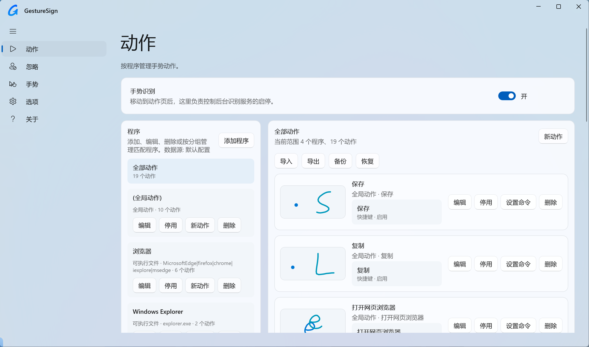

<p align="center">
  
</p>

<h1 align="center">GestureSign V2</h1>

<p align="center">
  为 Windows 11 重新打磨的触控板 / 鼠标手势工具。
</p>

<p align="center">
  <a href="https://github.com/Tomclanc/GestureSignv2/releases/latest">
    
  </a>
  
  
  
</p>



## 项目简介

GestureSign V2 是基于经典开源项目 [TransposonY/GestureSign](https://github.com/TransposonY/GestureSign) 的 Windows 11 适配重构版。

原版 GestureSign 长期未维护，在新系统和高强度使用场景下容易遇到按键粘滞、界面老旧、DPI 适配不足等问题。这个版本的目标很直接：保留原来的手势能力，同时修复 Windows 11 下的体验问题，并用更现代的 WinUI 3 界面重新承载配置流程。

## 主要特性

- WinUI 3 重构界面，适配 Windows 11 圆角、Mica 风格、深色 / 亮色模式动态切换。
- 支持触控板手势、鼠标手势、手势轨迹显示和手势缩略图预览。
- 支持按程序、窗口类名、可执行文件、标题和分组管理动作。
- 支持快捷键、浏览器、窗口、媒体、系统操作等常用命令。
- 支持忽略列表，可按 exe、窗口类名、标题等规则排除指定程序。
- 支持优先使用系统触控板设置、Edge 自带手势，并可排除全屏场景。
- 支持托盘图标、托盘菜单、单实例启动和更方便阅读的手势日志。
- 针对高 DPI、高刷新率屏幕做了界面和输入体验优化。

## 下载

前往 [Releases](https://github.com/Tomclanc/GestureSignv2/releases/latest) 下载最新版安装包。

当前版本：

- [GestureSign-V2-Setup-x64-8.1.9725.msi](https://github.com/Tomclanc/GestureSignv2/releases/download/v8.1.9725/GestureSign-V2-Setup-x64-8.1.9725.msi)

## 安装

1. 下载 MSI 安装包。
2. 双击安装，按提示完成安装。
3. 从桌面快捷方式或开始菜单打开 `GestureSign 设置`。
4. 在“动作”页面启用手势识别，并按需添加程序、手势和命令。

配置文件默认保存在：

```text
%AppData%\GestureSign
```

日志文件默认保存在：

```text
%LocalAppData%\GestureSign
```

## 快速使用

1. 打开“动作”页面，确认“手势识别”已开启。
2. 在左侧选择“全局动作”或某个程序分组。
3. 点击“新动作”，录制或绘制一个手势图案。
4. 点击“设置命令”，为这个手势绑定快捷键、浏览器、窗口或系统命令。
5. 回到桌面或目标应用中使用手势触发操作。

如果某个程序已经有系统级手势或自带手势，例如 Windows 11 触控板设置、Microsoft Edge 鼠标手势，可以在“选项”中开启优先使用系统或应用自带行为。

## 页面说明

- “动作”：管理全局动作、程序动作、分组、手势和命令。
- “忽略”：添加不参与识别的程序、窗口或匹配规则。
- “手势”：查看、导入、导出、重训和整理手势库。
- “选项”：调整轨迹颜色、宽度、透明度、输入设备、全屏排除和启动项。
- “关于”：查看版本、项目链接、日志和维护信息。

## 兼容性

- 推荐系统：Windows 11 x64
- 安装包：MSI x64
- Windows 10 理论上可运行部分功能，但主要适配目标是 Windows 11。

## 反馈问题

如果遇到手势无法触发、录制异常、配置无法保存或界面显示问题，请在 Issues 中提供：

- 系统版本和屏幕缩放比例。
- 使用的是鼠标手势还是触控板手势。
- 目标应用名称，以及是否全屏。
- “关于”页面中的日志内容。
- 相关截图或复现步骤。

## 致谢

感谢原项目 [TransposonY/GestureSign](https://github.com/TransposonY/GestureSign) 以及 HighSign、MahApps.Metro、WGestures 等项目。GestureSign V2 仍然站在这些工作的基础上继续前进。

