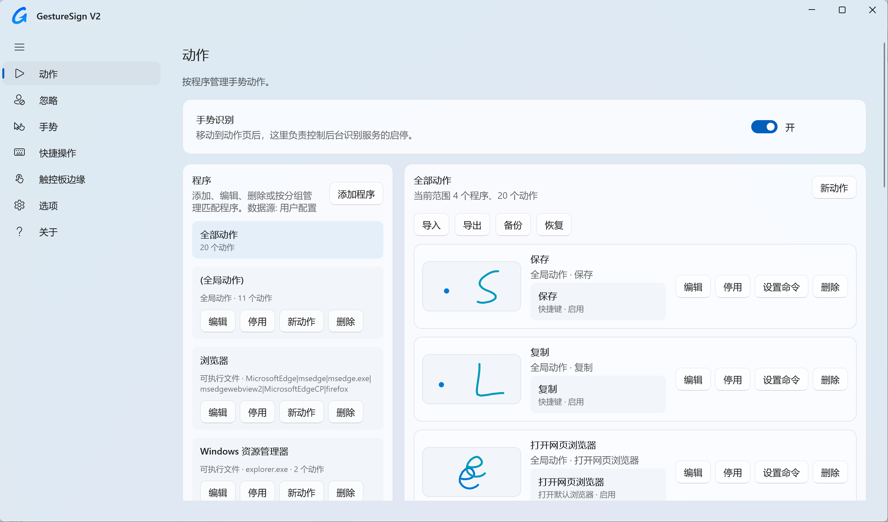

<p align="center">
  
</p>

<h1 align="center">GestureSign V2</h1>

<p align="center">
  为 Windows 11 重新打磨的触控板 / 鼠标手势工具。
</p>

<p align="center">
  <a href="https://github.com/Tomclanc/GestureSignv2/releases/tag/v16.4.17">
    
  </a>
  <a href="https://winstall.app/apps/Tomclanc.GestureSignV2">
    
  </a>
  
  
  
</p>

<p align="center">
  简体中文 | <a href="#english">English</a> | <a href="#日本語">日本語</a>
</p>



## 项目简介

GestureSign V2 是基于经典开源项目 [TransposonY/GestureSign](https://github.com/TransposonY/GestureSign) 的 Windows 11 适配重构版。

原版 GestureSign 长期未维护，在新系统和高强度使用场景下容易遇到按键粘滞、界面老旧、DPI 适配不足等问题。这个版本的目标很直接：保留原来的手势能力，同时修复 Windows 11 下的体验问题，并用更现代的 WinUI 3 界面重新承载配置流程。

## 主要特性

- WinUI 3 重构界面，适配 Windows 11 圆角、Mica 风格、深色 / 亮色模式动态切换。
- 支持触控板手势、触摸屏手势、鼠标手势、手势轨迹显示和手势缩略图预览。
- 新增“快捷操作”页面，内置 Kando 圆环菜单，可用独立快捷键唤起漂亮的径向菜单。
- 新增“边缘交互”页面，可为触控板和触摸屏上 / 下 / 左 / 右边缘点击与边缘滑动单独绑定动作。
- 边缘手势可作为普通动作加入任意程序分组，当前应用动作优先，未命中时自动回退全局动作。
- 支持按程序、窗口类名、可执行文件、标题和分组管理动作。
- 支持快捷键、浏览器、窗口、媒体、系统操作等常用命令；新增动作时可直接配置要执行的命令，音量、亮度、打开文件、运行命令等常用命令提供专用编辑控件。
- 支持忽略列表，可按 exe、窗口类名、标题等规则排除指定程序。
- 支持优先使用系统触控板设置、Edge 自带手势，并可排除全屏场景。
- 支持将配置文件切换到 OneDrive `Apps\GestureSign V2` 目录，由 OneDrive 负责跨设备同步。
- 支持托盘图标、托盘菜单、单实例启动和更方便阅读的手势日志；托盘可一键暂停/恢复手势识别。
- 支持简体中文、英文、繁体中文（台湾）、日语、韩语界面语言。
- 针对高 DPI、高刷新率屏幕做了界面和输入体验优化。

## 下载

GestureSign V2 已发布到 Windows Package Manager，可以直接通过 winget 安装：

```powershell
winget install --id Tomclanc.GestureSignV2 --source winget
```

也可以前往 [Releases](https://github.com/Tomclanc/GestureSignv2/releases/tag/v16.4.17) 下载最新版安装包。

当前版本：

- [GestureSign-V2-16.4.17-x64.msi](https://github.com/Tomclanc/GestureSignv2/releases/download/v16.4.17/GestureSign-V2-16.4.17-x64.msi)
- [GestureSign-V2-16.4.17-portable-x64.zip](https://github.com/Tomclanc/GestureSignv2/releases/download/v16.4.17/GestureSign-V2-16.4.17-portable-x64.zip)

## 更新内容

### 16.4.17

- 更新“关于”页面，维护者信息改为“风夏”，并显示完整版本号 `16.4.17`。
- 将版本说明统一为“WinUI3重构”，更新 QQ 交流群为 `1054687130`，反馈邮箱为 `z1021847549@outlook.com`。
- 项目页面补充 GestureSign V2 当前仓库、TransposonY 原始项目及 Kando 项目链接，并保留 highsign、MahApps.Metro、WGestures 致谢信息。

### 16.4.16

- 托盘菜单会跟随 GestureSign V2 的界面语言动态切换，托盘提示名称统一为 `GestureSign V2`；单击菜单“设置”或双击托盘图标都会进入新的 WinUI 3 设置界面。
- 移除旧版 WPF 控制面板及相关打包文件，动作页底部旧版“编辑入口”同步隐藏，避免误入已经停用的旧界面。
- 优化 ROG Xbox 等触屏设备上的托盘菜单操作：增大菜单宽度、字体和单项触控区域，消除菜单项之间无法点击的空隙，并修复右键事件重复显示菜单的问题。
- 修复 MSIX / 微软商店安装后后台可能因 `System.Memory`、`System.Resources.Extensions` 等依赖版本冲突而启动失败的问题，前端和后台依赖改为隔离部署。
- 完善 MSIX 商店身份、图标资源、语言资源和启动布局，移除不需要的调试文件，提升商店审核环境中的启动稳定性。
- 修复动作页新增、编辑、启用或停用动作后列表可能跳回顶部的问题，并优化程序分组快速切换和动作缩略图即时刷新。
- 优化微信图片等独立窗口中的手势触发稳定性：绘制过程中若已匹配到当前分组的可执行动作，松手瞬间漂移到无动作手势时会保守回退到最近的有效候选。
- 微信程序分组会自动包含 `WeChatAppEx.exe`，覆盖微信小程序、微信内 PDF/图片等独立窗口。
- 普通手势缩略图增加方向箭头，新建或录制的手势在动作列表中更容易判断绘制方向。
- 远程桌面窗口默认透传鼠标手势输入，修复本机 GestureSign 截获右键轨迹后，远端 Edge 等应用无法触发自身鼠标手势的问题；支持 `mstsc.exe`、`msrdc.exe`、`RdClient.Windows.exe`、`Windows365.exe` 和 `vmconnect.exe`。

### 16.3

- 优化动作页左侧程序分组的快速点击体验，程序行改为鼠标释放时立即切换，减少 WinUI 点击判定带来的延迟。
- 右侧动作列表改为可中断的分批渲染，快速切换分组时旧列表绘制会自动作废，只保留最后一次选择。
- 修复靠近左侧列表底部的程序分组点击时可能触发自动滚动，导致切换偶发变慢的问题。
- 修复在右侧列表新增或编辑动作后，保存时动作列表可能跳回顶部的问题。
- 修复编辑动作时通过触控板/触控录制新手势后，动作没有立即生效、缩略图不能及时更新的问题。
- 增强 Windows 资源管理器窗口识别，对资源管理器和桌面 Shell 窗口稳定兜底为 `explorer.exe`，减少必须手动拾取窗口后才生效的情况。

### 16.2

- 修复动作页左侧程序分组和右侧动作的启用/停用按钮状态不会即时刷新的问题。
- 修复点击启用/停用后，左右列表或页面滚动位置跳到顶部的问题。
- 修复新增多个同名或未命名手势动作后，编辑最后一个动作可能改到前一个手势图案的问题。
- 修复桌面等非浏览器窗口下，手势可能误命中浏览器分组的问题，强化空匹配和程序匹配规则。
- 动作页左右列表布局更紧凑，手势动作列表支持独立滚动，减少底部空白。
- 切换界面语言时，轨迹颜色预设名称会同步切换语言。
- MSI 打包流程会重新编译并复制最新 WinUI、后台服务和 Kando 文件，避免安装包带入旧界面文件。

### 8.2.16

- 修复“添加程序 / 捕捉窗口”对 Windows Terminal 等现代窗口识别不稳定的问题，优先使用低权限进程路径查询，并兼容 `WindowsTerminal.exe`、`wt.exe`、`OpenConsole.exe` 等终端进程名。
- 捕捉窗口时增加悬停确认：选中同一个目标窗口持续 3 秒会自动确认并返回 GestureSign V2，触控板操作时不再必须点击目标窗口。
- 优化捕捉结束后的窗口恢复逻辑，减少触控板点击后无法回到保存弹窗、退出捕捉时偶发闪退的问题。
- 修复普通手势缩略图被强制拉伸的问题，保留原有比例显示；触控板边缘动作继续使用完整触控板样式缩略图。
- MSI 和便携版恢复简洁正式命名，统一发布为 `GestureSign-V2-8.2.16-x64.msi` 与 `GestureSign-V2-8.2.16-portable-x64.zip`。

### 8.2.15

- 优化触控板边缘手势缩略图，改为显示完整触控板样式，动作列表更直观。
- 动作编辑弹窗中的内置触控板/触摸屏边缘触发方式会按当前界面语言显示，保存时仍保留兼容旧配置的内部手势名。
- 统一普通手势缩略图的视觉尺寸，让动作列表排版更整齐。
- 暂时隐藏动作页顶部导入、导出、备份、恢复快捷按钮，减少日常配置时的界面干扰。
- MSI 开始菜单只创建主程序快捷方式，不再额外创建卸载快捷方式。
- 修复安装后 Daemon 可能因 `System.Resources.Extensions` 版本绑定不匹配而启动报错的问题。

### 8.2.14

- 新增 OneDrive 配置同步选项，可将 GestureSign V2 配置切换到当前用户 OneDrive 的 `Apps\GestureSign V2` 目录。
- 新增动作时可在弹窗底部直接配置“要执行的命令”，保存动作时同步创建初始命令。
- “新动作”按钮会默认添加到当前选中的程序或分组，不再总是落到全局动作。
- 边缘手势动作支持程序/分组匹配：当前应用动作优先，找不到可执行动作时回退全局动作。
- 触控板边缘、触控屏边缘动作在动作列表中显示专用缩略图，不再显示英文原始手势名。
- 手势名称匹配改为忽略大小写，减少旧配置或手动输入导致的边缘动作不触发问题。
- 手势动作提示改为识别过程中实时显示匹配到的动作名称，松手后立即消失。
- MSI 继续内置 Kando，安装后释放到 `GestureSign V2\Kando\kando.exe`。

### 8.2.13

- 重构 WinUI 3 设置界面，完善 Windows 11 风格、Mica / 圆角托盘菜单和深色模式适配。
- 新增“边缘交互”页面，支持触控板与触摸屏四边点击和边缘滑动动作配置。
- 修复触摸屏边缘手势触发、轨迹显示、托盘菜单交互和命令执行相关问题。
- 适配 Windows 11 Xbox 大屏模式，进入 / 退出大屏模式时自动调整窗口控制按钮。
- 改进命令编辑体验：音量、亮度、打开文件、运行命令等命令提供专用编辑控件。
- 运行命令支持 CMD / PowerShell、管理员权限和显示窗口选项。
- 完善简体中文、英文、繁体中文（台湾）、日语、韩语多语言适配。
- 新增选项页“退出”操作，可退出相关进程；卸载时可选择清理相关残留文件。
- 同步发布 MSI 安装包和 x64 便携版。

### 8.1.9807

- 新增触控屏边缘操作，可为屏幕上 / 下 / 左 / 右边缘点击和边缘滑动单独绑定动作。
- 适配 Windows 11 Xbox 大屏模式，进入大屏模式时隐藏右上角窗口按钮，退出后自动恢复。
- “显示触发的手势操作”提示增加淡入淡出动画，出现和消失更自然。
- 优化提示和大屏模式状态刷新，减少切换时的突兀感。

### 8.1.9783

- 配置目录迁移到 `%AppData%\GestureSign V2`。
- 首次启动会从旧目录 `%AppData%\GestureSign` 自动复制现有配置，保留原有动作、选项和手势数据。
- 旧目录不会自动删除，方便回滚或手动备份。

### 8.1.9782

- 退出 GestureSign V2 后台时，会同步结束集成安装目录下的 Kando 进程。

### 8.1.9781

- 新增“快捷操作”页面，安装包内置 Kando，可直接从 GestureSign V2 选择 Kando 菜单并同步快捷键。
- 支持实时读取 `%AppData%\kando\menus.json` 中的菜单名称和快捷键，菜单列表可单击选择。
- “启用快捷操作”开关现在会在开启时拉起 Kando，关闭时结束集成的 Kando 进程；启动 GestureSign V2 时也会按配置自动拉起。
- 新增触发手势动作提示，可在任务栏上方显示刚触发的手势/动作名称。
- 托盘菜单“关闭手势识别”改为真正的总开关，关闭后图标变红，并可再次点击恢复。
- 修复托盘红色图标使用旧资源导致 `System.Resources.Extensions` 加载错误的问题。
- MSI 改为合并包，安装后会释放 Kando 到 `GestureSign V2\Kando\kando.exe`。

### 8.1.9760

- 修正安装包发布方式，WinUI 3 前端改为随 MSI 自带 .NET 运行时。
- 重新生成 MSI 文件清单，避免在未安装 .NET 8 Desktop Runtime 的电脑上启动失败。
- 更新关于页、程序集版本和安装包版本，方便覆盖安装识别新版。

### 8.1.9759

- 修复触控板多指轨迹的可视反馈错位问题，保留多根手指之间的相对位置。
- 优化触控板训练预览，左手点按、右手绘制等组合手势会按真实相对位置显示。
- 保持手势识别判断逻辑不变，仅调整屏幕轨迹显示和训练预览坐标。

### 8.1.9758

- 优化命令编辑弹窗，启动应用 / 运行命令不再要求手写 JSON。
- 新增已安装应用下拉列表，可直接选择桌面应用。
- 新增“浏览 EXE”，支持用户手动选择任意可执行文件。

### 8.1.9757

- 修复覆盖安装时 WinUI 前端 DLL 可能不被替换的问题。
- 为 WinUI 前端补充文件版本号，并增强安装器的进程关闭和强制覆盖逻辑。

### 8.1.9756

- 优化触控板边缘页面排版，去掉多余方向线条。
- 调整上 / 下边缘操作为横向排列，避免文字遮挡。

### 8.1.9755

- 新增触控板边缘功能，支持四边点击和边缘滑动触发动作。
- 新增“触控板边缘”导航页，可直接为每个边缘动作配置命令。
- 修复触控板边缘动作捕获顺序，避免单指边缘操作被全局手势过滤。

### 8.1.9754

- 优化托盘右键菜单退出逻辑，退出时会关闭相关 GestureSign V2 进程。
- 修复 WinUI 前端安装后双击无窗口、进程快速退出的问题。
- 安装包补充 WinUI 资源文件，提升覆盖安装稳定性。

### 8.1.9752

- 为日常触控板手势增加空闲释放兜底，减少触控板手势结束后鼠标右键手势偶发不触发的问题。
- 保持触控板录制原有释放补偿逻辑，同时扩展到普通触控板手势输入。

### 8.1.9751

- 修复触控板手势结束后，后续鼠标右键手势可能不再触发的问题。
- 在触控板释放事件后清理残留触摸状态，避免必须重启后台程序才能恢复鼠标手势。

### 8.1.9750

- 修复开启“优先使用 Windows 触控板系统手势”后触控板手势被整体禁用的问题。
- 保留触控板 raw input 注册，避免旧配置文件导致触控板手势、轨迹线失效。
- 说明：开启“Edge 优先使用自带鼠标手势”后，Edge 窗口内的右键手势会交给 Edge 自带手势处理。

### 8.1.9749

- 修复触控板、触控屏和鼠标右键手势的轨迹显示与触发稳定性。
- 修复子动作“启用 / 停用”后后台动作列表不立即生效的问题。
- 恢复“手势识别”总开关为动态开关，可直接控制后台识别服务启停。
- 修复“优先使用 Windows 触控板系统手势”选项不生效的问题。
- 优化触控板或触控录制入口描述，保留多指手势录制兼容逻辑。
- 更新 WinUI 3 设置界面版本号与下载链接。

## 安装

推荐使用 winget 安装：

```powershell
winget install --id Tomclanc.GestureSignV2 --source winget
```

也可以手动下载安装包：

1. 下载 MSI 安装包。
2. 双击安装，按提示完成安装。
3. 从桌面快捷方式或开始菜单打开 `GestureSign V2`。
4. 在“动作”页面启用手势识别，并按需添加程序、手势和命令。

配置文件默认保存在：

```text
%AppData%\GestureSign V2
```

日志文件默认保存在：

```text
%LocalAppData%\GestureSign V2
```

## 快速使用

1. 打开“动作”页面，确认“手势识别”已开启。
2. 在左侧选择“全局动作”或某个程序分组。
3. 点击“新动作”，录制或绘制一个手势图案。
4. 点击“设置命令”，为这个手势绑定快捷键、浏览器、窗口或系统命令。
5. 回到桌面或目标应用中使用手势触发操作。

如果某个程序已经有系统级手势或自带手势，例如 Windows 11 触控板设置、Microsoft Edge 鼠标手势，可以在“选项”中开启优先使用系统或应用自带行为。

## 页面说明

- “动作”：管理全局动作、程序动作、分组、手势和命令。
- “忽略”：添加不参与识别的程序、窗口或匹配规则。
- “手势”：查看、导入、导出、重训和整理手势库。
- “快捷操作”：选择 Kando 菜单、同步唤起快捷键、打开 Kando 设置或测试弹出菜单。
- “边缘交互”：设置触控板和触摸屏四边点击与边缘滑动动作。
- “选项”：调整轨迹颜色、宽度、透明度、输入设备、全屏排除和启动项。
- “关于”：查看版本、项目链接、日志和维护信息。

## 兼容性

- 推荐系统：Windows 11 x64
- 安装包：MSI x64
- Windows 10 理论上可运行部分功能，但主要适配目标是 Windows 11。

## 反馈问题

如果遇到手势无法触发、录制异常、配置无法保存或界面显示问题，请在 Issues 中提供：

- 系统版本和屏幕缩放比例。
- 使用的是鼠标手势还是触控板手势。
- 目标应用名称，以及是否全屏。
- “关于”页面中的日志内容。
- 相关截图或复现步骤。

## 致谢

感谢原项目 [TransposonY/GestureSign](https://github.com/TransposonY/GestureSign) 以及 HighSign、MahApps.Metro、WGestures 等项目。GestureSign V2 仍然站在这些工作的基础上继续前进。

“快捷操作”功能集成并随安装包分发了 [Kando](https://github.com/kando-menu/kando) 的圆环菜单交互。Kando 是独立的开源项目，遵循 MIT License；安装包中保留了 Kando 自带的 `LICENSE` 和 Chromium 相关许可证文件。

---

## English

GestureSign V2 is a Windows 11 focused rebuild of the classic open-source project [TransposonY/GestureSign](https://github.com/TransposonY/GestureSign).

The original GestureSign has not been actively maintained for a long time. On newer Windows systems, users may run into sticky modifier keys, dated UI behavior, DPI issues, and inconsistent gesture capture. GestureSign V2 keeps the original gesture workflow while improving the Windows 11 experience and moving the configuration interface to a modern WinUI 3 design.

## Features

- Rebuilt WinUI 3 interface with Windows 11 rounded corners, Mica styling, and light / dark theme support.
- Touchpad, touchscreen, and mouse gestures with gesture trails and thumbnail previews.
- New Quick Actions page with bundled Kando radial menus and a dedicated hotkey trigger.
- New Edge Interaction page for touchpad and touchscreen edge taps and edge swipes.
- Edge gestures can also be added to regular app groups; app-specific actions take priority and fall back to global actions when no executable app action is found.
- Per-app actions with matching by executable, window class, title, and groups.
- Common commands such as hotkeys, browser actions, window actions, media controls, system operations, file launching, volume, brightness, and command execution. New actions can include their initial command directly from the add-action dialog.
- Ignore list support for excluding specific apps, windows, or matching rules.
- Options to prefer Windows touchpad gestures or built-in browser gestures, with fullscreen exclusions.
- Optional OneDrive sync stores configuration under `OneDrive\Apps\GestureSign V2` and lets OneDrive handle cross-device synchronization.
- Tray icon, tray menu, single-instance startup, readable gesture logs, and one-click pause/resume from the tray.
- Simplified Chinese, English, Traditional Chinese (Taiwan), Japanese, and Korean UI languages.
- Improved UI and input behavior for high-DPI and high-refresh-rate displays.

## Download

GestureSign V2 is available from Windows Package Manager. Install it with winget:

```powershell
winget install --id Tomclanc.GestureSignV2 --source winget
```

You can also get the latest installer from [Releases](https://github.com/Tomclanc/GestureSignv2/releases/tag/v16.4.16).

Current version:

- [GestureSign-V2-16.4-x64.msi](https://github.com/Tomclanc/GestureSignv2/releases/download/v16.4/GestureSign-V2-16.4-x64.msi)
- [GestureSign-V2-16.4-portable-x64.zip](https://github.com/Tomclanc/GestureSignv2/releases/download/v16.4/GestureSign-V2-16.4-portable-x64.zip)

## Installation

Recommended:

```powershell
winget install --id Tomclanc.GestureSignV2 --source winget
```

Manual installation:

1. Download the MSI installer.
2. Double-click the installer and follow the setup prompts.
3. Open `GestureSign V2` from the desktop shortcut or Start menu.
4. Go to the Actions page, enable gesture recognition, and add apps, gestures, and commands as needed.

Configuration files are stored in:

```text
%AppData%\GestureSign V2
```

When OneDrive sync is enabled, configuration is stored in:

```text
%UserProfile%\OneDrive\Apps\GestureSign V2
```

Log files are stored in:

```text
%LocalAppData%\GestureSign V2
```

## Quick Start

1. Open the Actions page and make sure gesture recognition is enabled.
2. Select Global Actions or an app group on the left.
3. Click New Action and record or draw a gesture pattern.
4. Click Set Command and bind the gesture to a hotkey, browser action, window action, or system command.
5. Return to the desktop or target app and trigger the gesture.

If an app already has system-level or built-in gestures, such as Windows 11 touchpad gestures or Microsoft Edge mouse gestures, you can enable the related preference options on the Options page.

## Pages

- Actions: Manage global actions, app actions, groups, gestures, and commands.
- Ignore: Exclude apps, windows, or matching rules from gesture recognition.
- Gestures: View, import, export, retrain, and organize the gesture library.
- Quick Actions: Select Kando menus, sync hotkeys, open Kando settings, or test the radial menu.
- Edge Interaction: Configure touchpad and touchscreen edge taps and edge swipes.
- Options: Adjust trail color, width, opacity, input devices, fullscreen exclusions, and startup behavior.
- About: View the version, project links, logs, and maintenance information.

## Compatibility

- Recommended OS: Windows 11 x64
- Installer: MSI x64
- Windows 10 may run some features, but Windows 11 is the primary target.

## Feedback

When reporting gesture, recording, saving, or UI issues, please include:

- Windows version and display scaling.
- Whether you are using mouse gestures or touchpad gestures.
- Target app name and whether it is fullscreen.
- Logs from the About page.
- Screenshots or reproduction steps.

## Credits

Thanks to [TransposonY/GestureSign](https://github.com/TransposonY/GestureSign), HighSign, MahApps.Metro, WGestures, and the projects this work builds on.

The Quick Actions feature integrates and redistributes the radial menu experience from [Kando](https://github.com/kando-menu/kando). Kando is an independent open-source project under the MIT License; its bundled `LICENSE` and Chromium license files are preserved in the installer.

---

## 日本語

GestureSign V2 は、クラシックなオープンソースプロジェクト [TransposonY/GestureSign](https://github.com/TransposonY/GestureSign) を Windows 11 向けに再構築したバージョンです。

元の GestureSign は長い間積極的にメンテナンスされていません。新しい Windows 環境では、修飾キーが押されたままになる、UI の挙動が古い、高 DPI 環境で表示が崩れる、ジェスチャー入力が安定しない、といった問題が起こることがあります。GestureSign V2 は従来のジェスチャーワークフローを保ちながら、Windows 11 での体験を改善し、設定画面をモダンな WinUI 3 デザインへ移行しています。

## 主な機能

- Windows 11 の角丸、Mica スタイル、ライト / ダークテーマに対応した WinUI 3 インターフェイス。
- タッチパッド、タッチスクリーン、マウスジェスチャー、ジェスチャー軌跡、ジェスチャーサムネイルプレビュー。
- Kando のラジアルメニューを同梱した Quick Actions ページと、専用ホットキーによる呼び出し。
- タッチパッドとタッチスクリーンのエッジタップ / エッジスワイプを設定できる Edge Interaction ページ。
- エッジジェスチャーは通常のアプリグループにも追加でき、アプリ別アクションを優先し、見つからない場合はグローバルアクションへフォールバックします。
- 実行ファイル、ウィンドウクラス、タイトル、グループによるアプリ別アクション管理。
- ホットキー、ブラウザー操作、ウィンドウ操作、メディア制御、システム操作などの一般的なコマンド。新規アクション作成時に初期コマンドも同じダイアログで設定できます。
- 特定のアプリ、ウィンドウ、マッチングルールを除外できる無視リスト。
- Windows タッチパッドジェスチャーやブラウザー内蔵ジェスチャーを優先するオプションと、全画面除外設定。
- OneDrive 同期を有効にすると、設定を `OneDrive\Apps\GestureSign V2` に保存し、OneDrive でデバイス間同期できます。
- トレイアイコン、トレイメニュー、単一インスタンス起動、読みやすいジェスチャーログ、トレイからの一時停止 / 再開。
- 簡体字中国語、英語、繁体字中国語（台湾）、日本語、韓国語の UI 言語。
- 高 DPI および高リフレッシュレート環境向けの UI と入力体験の改善。

## ダウンロード

GestureSign V2 は Windows Package Manager からインストールできます:

```powershell
winget install --id Tomclanc.GestureSignV2 --source winget
```

最新のインストーラーは [Releases](https://github.com/Tomclanc/GestureSignv2/releases/tag/v16.4.16) からも入手できます。

現在のバージョン:

- [GestureSign-V2-16.4-x64.msi](https://github.com/Tomclanc/GestureSignv2/releases/download/v16.4/GestureSign-V2-16.4-x64.msi)
- [GestureSign-V2-16.4-portable-x64.zip](https://github.com/Tomclanc/GestureSignv2/releases/download/v16.4/GestureSign-V2-16.4-portable-x64.zip)

## インストール

推奨:

```powershell
winget install --id Tomclanc.GestureSignV2 --source winget
```

手動インストール:

1. MSI インストーラーをダウンロードします。
2. インストーラーをダブルクリックし、画面の案内に従ってセットアップを完了します。
3. デスクトップショートカットまたはスタートメニューから `GestureSign V2` を開きます。
4. Actions ページでジェスチャー認識を有効にし、必要に応じてアプリ、ジェスチャー、コマンドを追加します。

設定ファイルは次の場所に保存されます:

```text
%AppData%\GestureSign V2
```

OneDrive 同期を有効にした場合、設定ファイルは次の場所に保存されます:

```text
%UserProfile%\OneDrive\Apps\GestureSign V2
```

ログファイルは次の場所に保存されます:

```text
%LocalAppData%\GestureSign V2
```

## クイックスタート

1. Actions ページを開き、ジェスチャー認識が有効になっていることを確認します。
2. 左側で Global Actions またはアプリグループを選択します。
3. New Action をクリックし、ジェスチャーパターンを記録または描画します。
4. Set Command をクリックし、そのジェスチャーにホットキー、ブラウザー操作、ウィンドウ操作、またはシステムコマンドを割り当てます。
5. デスクトップまたは対象アプリに戻り、ジェスチャーを実行します。

アプリが Windows 11 のタッチパッドジェスチャーや Microsoft Edge のマウスジェスチャーなど、システムまたはアプリ内蔵のジェスチャーを持っている場合は、Options ページで関連する優先オプションを有効にできます。

## ページ

- Actions: グローバルアクション、アプリアクション、グループ、ジェスチャー、コマンドを管理します。
- Ignore: ジェスチャー認識から除外するアプリ、ウィンドウ、マッチングルールを設定します。
- Gestures: ジェスチャーライブラリの表示、インポート、エクスポート、再学習、整理を行います。
- Quick Actions: Kando メニューの選択、ホットキー同期、Kando 設定の起動、ラジアルメニューのテストを行います。
- Edge Interaction: タッチパッドとタッチスクリーンのエッジタップ / エッジスワイプを設定します。
- Options: 軌跡の色、幅、透明度、入力デバイス、全画面除外、起動動作を調整します。
- About: バージョン、プロジェクトリンク、ログ、メンテナンス情報を確認します。

## 互換性

- 推奨 OS: Windows 11 x64
- インストーラー: MSI x64
- Windows 10 でも一部機能は動作する可能性がありますが、主な対象は Windows 11 です。

## フィードバック

ジェスチャー、記録、保存、UI 表示に関する問題を報告する場合は、次の情報を含めてください。

- Windows のバージョンとディスプレイの拡大率。
- マウスジェスチャーまたはタッチパッドジェスチャーのどちらを使用しているか。
- 対象アプリ名と、全画面表示かどうか。
- About ページのログ。
- スクリーンショットまたは再現手順。

## クレジット

[TransposonY/GestureSign](https://github.com/TransposonY/GestureSign)、HighSign、MahApps.Metro、WGestures、および本プロジェクトの基礎となった各プロジェクトに感謝します。

Quick Actions 機能では、[Kando](https://github.com/kando-menu/kando) のラジアルメニュー体験を統合し、インストーラーに同梱しています。Kando は MIT License の独立したオープンソースプロジェクトであり、同梱される `LICENSE` と Chromium 関連のライセンスファイルを保持しています。
