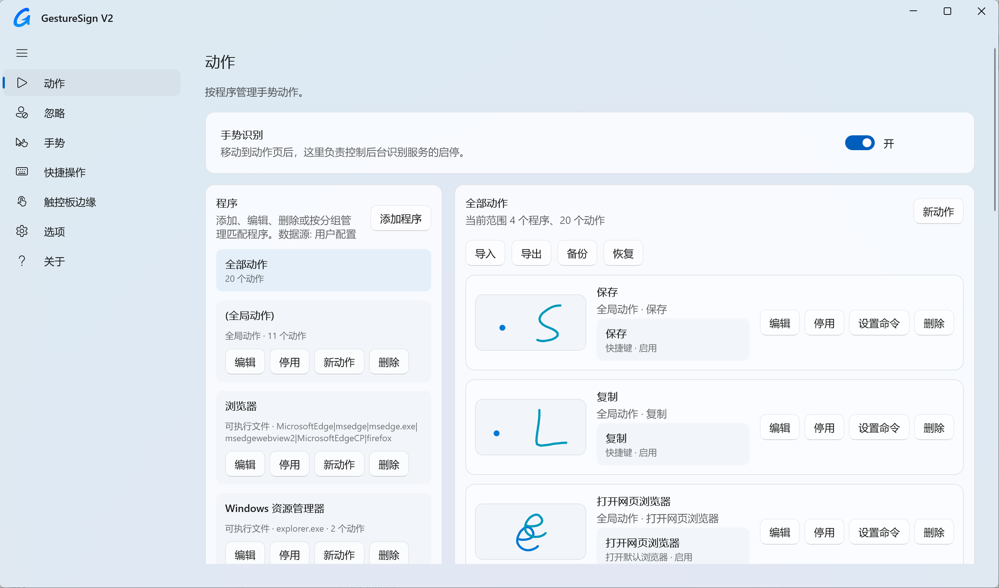
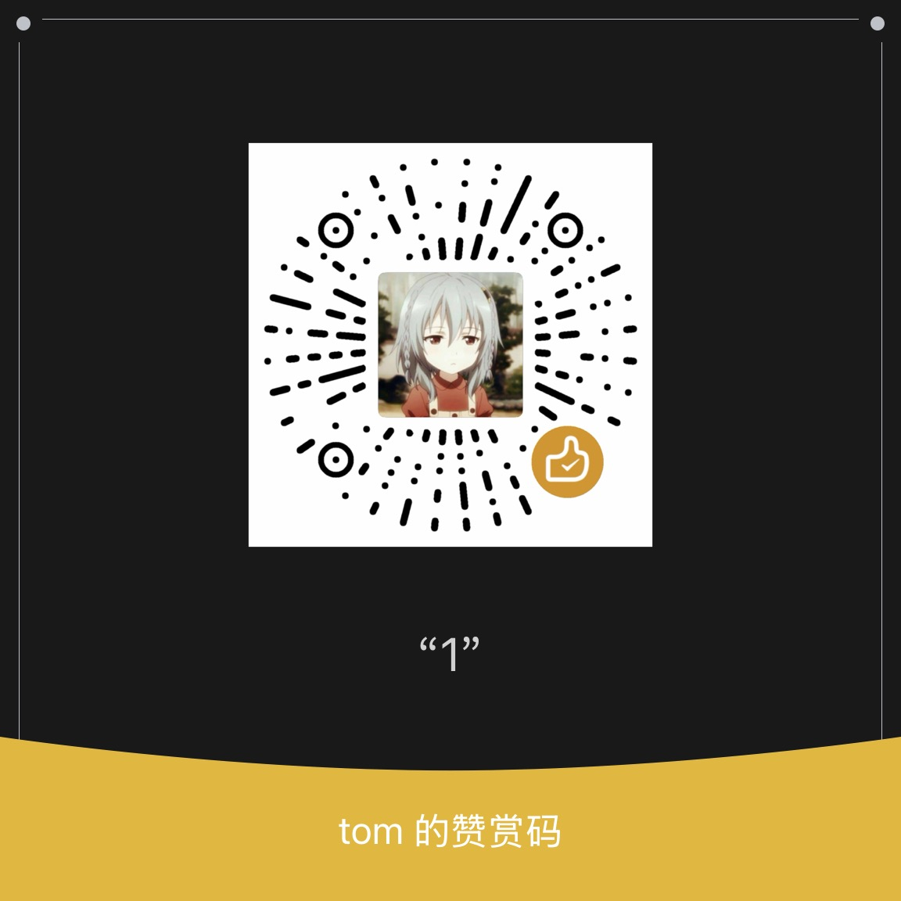

<p align="center">
  
</p>

<h1 align="center">GestureSign V2</h1>

<p align="center">
  为 Windows 11 重新打磨的触控板 / 鼠标手势工具。
</p>

<p align="center">
  <a href="https://github.com/Tomclanc/GestureSignv2/releases/tag/v17.2">
    
  </a>
  <a href="https://winstall.app/apps/Tomclanc.GestureSignV2">
    
  </a>
  <a href="https://apps.microsoft.com/store/detail/9P2WKMHF43PN?cid=DevShareMCLPCB">
    
  </a>
  
  
  
</p>

<p align="center">
  简体中文 | <a href="#english">English</a> | <a href="#日本語">日本語</a>
</p>



## 项目简介

GestureSign V2 是基于经典开源项目 [TransposonY/GestureSign](https://github.com/TransposonY/GestureSign) 的 Windows 11 适配重构版。

原版 GestureSign 长期未维护，在新系统和高强度使用场景下容易遇到按键粘滞、界面老旧、DPI 适配不足等问题。这个版本的目标很直接：保留原来的手势能力，同时修复 Windows 11 下的体验问题，并用更现代的 WinUI 3 界面重新承载配置流程。

## 主要特性

- WinUI 3 重构界面，适配 Windows 11 圆角、Mica 风格、深色 / 亮色模式动态切换。
- 支持触控板手势、触摸屏手势、鼠标手势、手势轨迹显示和手势缩略图预览。
- 新增“快捷操作”页面，内置 Kando 圆环菜单，可用独立快捷键唤起漂亮的径向菜单。
- 新增“边缘交互”页面，可为触控板和触摸屏上 / 下 / 左 / 右边缘点击与边缘滑动单独绑定动作。
- 边缘手势可作为普通动作加入任意程序分组，当前应用动作优先，未命中时自动回退全局动作。
- 支持按程序、窗口类名、可执行文件、标题和分组管理动作。
- 支持快捷键、浏览器、窗口、媒体、系统操作等常用命令；新增动作时可直接配置要执行的命令，音量、亮度、打开文件、运行命令等常用命令提供专用编辑控件。
- 支持忽略列表，可按 exe、窗口类名、标题等规则排除指定程序。
- 支持优先使用系统触控板设置、Edge 自带手势，并可排除全屏场景。
- 支持将配置文件切换到 OneDrive `Apps\GestureSign V2` 目录，由 OneDrive 负责跨设备同步。
- 支持托盘图标、托盘菜单、单实例启动和更方便阅读的手势日志；托盘可一键暂停/恢复手势识别。
- 支持简体中文、英文、繁体中文（台湾）、日语、韩语界面语言。
- 针对高 DPI、高刷新率屏幕做了界面和输入体验优化。

## 下载

### Microsoft Store（推荐）

<a href="https://apps.microsoft.com/store/detail/9P2WKMHF43PN?cid=DevShareMCLPCB"></a>

### WinGet

GestureSign V2 已发布到 Windows Package Manager，可以直接通过 winget 安装：

```powershell
winget install --id Tomclanc.GestureSignV2 --source winget
```

也可以前往 [Releases](https://github.com/Tomclanc/GestureSignv2/releases/tag/v17.2) 下载最新版安装包。

当前版本：

- [GestureSign-V2-17.2-x64.msi](https://github.com/Tomclanc/GestureSignv2/releases/download/v17.2/GestureSign-V2-17.2-x64.msi)
- [GestureSign-V2-17.2-portable-x64.zip](https://github.com/Tomclanc/GestureSignv2/releases/download/v17.2/GestureSign-V2-17.2-portable-x64.zip)
- [GestureSign-V2-17.2-arm64-early-preview.msi](https://github.com/Tomclanc/GestureSignv2/releases/download/v17.2/GestureSign-V2-17.2-arm64-early-preview.msi)（Windows on ARM64 早期预览版）

> ARM64 版本是未签名的早期预览版。开发者目前没有 ARM64 Windows on Arm 设备，无法进行真实设备安装和运行测试；该构建仅完成编译、打包和 PE 架构静态检查，请谨慎使用并反馈问题。

ARM64 MSI SHA-256：`B7539A51DA9E991FF948D86F4C4FAF8874F2A718CC70069C1F49679197DFEC87`

## 更新内容

### 17.2

- 修复部分触摸屏及 OLED 设备无法触发手势的问题，改进原始触控数据包与触点 Tip 状态解析。
- 完善便携版识别和卸载流程，可正确关闭相关进程并清理便携目录，同时保留可选的用户数据清理行为。
- 卸载程序新增 Per-Monitor V2 高 DPI 适配，修复 200% 缩放下标题、说明、复选框和底部按钮被裁切的问题。
- 卸载程序标题栏跟随 Windows 深色 / 亮色模式，并统一使用圆角按钮和圆角进度条；进度轨道、边框及状态色会随系统主题切换。
- 修复卸载程序标题栏、任务栏及 Alt+Tab 使用系统默认图标的问题，统一显示 GestureSign V2 图标。

### 历史版本

早期版本完成了 WinUI 3 与 .NET 10 迁移，并持续改进手势识别、触控板和触摸屏输入、智能关闭、Kando 快捷操作、应用更新、高 DPI、远程桌面兼容性、内存占用及安装体验。完整的逐版本更新记录请参阅 [GitHub Releases](https://github.com/Tomclanc/GestureSignv2/releases)。

## 安装

推荐使用 winget 安装：

```powershell
winget install --id Tomclanc.GestureSignV2 --source winget
```

也可以手动下载安装包：

1. 下载 MSI 或 MSIX 安装包。
2. 双击安装，按提示完成安装。
3. 从桌面快捷方式或开始菜单打开 `GestureSign V2`。
4. 在“动作”页面启用手势识别，并按需添加程序、手势和命令。

配置文件默认保存在：

```text
%AppData%\GestureSign V2
```

日志文件默认保存在：

```text
%LocalAppData%\GestureSign V2
```

## 快速使用

1. 打开“动作”页面，确认“手势识别”已开启。
2. 在左侧选择“全局动作”或某个程序分组。
3. 点击“新动作”，录制或绘制一个手势图案。
4. 点击“设置命令”，为这个手势绑定快捷键、浏览器、窗口或系统命令。
5. 回到桌面或目标应用中使用手势触发操作。

如果某个程序已经有系统级手势或自带手势，例如 Windows 11 触控板设置、Microsoft Edge 鼠标手势，可以在“选项”中开启优先使用系统或应用自带行为。

## 页面说明

- “动作”：管理全局动作、程序动作、分组、手势和命令。
- “忽略”：添加不参与识别的程序、窗口或匹配规则。
- “手势”：查看、导入、导出、重训和整理手势库。
- “快捷操作”：选择 Kando 菜单、同步唤起快捷键、打开 Kando 设置或测试弹出菜单。
- “边缘交互”：设置触控板和触摸屏四边点击与边缘滑动动作。
- “选项”：调整轨迹颜色、宽度、透明度、输入设备、全屏排除和启动项。
- “关于”：查看版本、项目链接、日志和维护信息。

## 兼容性

- 推荐系统：Windows 11 x64；Windows on ARM64 目前为未经实机测试的早期预览支持。
- 安装包：MSI x64、便携版 x64、MSI ARM64 Early Preview；不再提供 x86 包。
- Windows 10 理论上可运行部分功能，但主要适配目标是 Windows 11。

## 反馈问题

如果遇到手势无法触发、录制异常、配置无法保存或界面显示问题，请在 Issues 中提供：

- 系统版本和屏幕缩放比例。
- 使用的是鼠标手势还是触控板手势。
- 目标应用名称，以及是否全屏。
- “关于”页面中的日志内容。
- 相关截图或复现步骤。

## 致谢

感谢原项目 [TransposonY/GestureSign](https://github.com/TransposonY/GestureSign) 以及 HighSign、MahApps.Metro、WGestures 等项目。GestureSign V2 仍然站在这些工作的基础上继续前进。

“快捷操作”功能集成并随安装包分发了 [Kando](https://github.com/kando-menu/kando) 的圆环菜单交互。Kando 是独立的开源项目，遵循 MIT License；安装包中保留了 Kando 自带的 `LICENSE` 和 Chromium 相关许可证文件。

## 赞赏

如果 GestureSign V2 对你有帮助，欢迎通过微信赞赏支持项目的持续开发。感谢每一份支持。



---

## English

GestureSign V2 is a Windows 11 focused rebuild of the classic open-source project [TransposonY/GestureSign](https://github.com/TransposonY/GestureSign).

The original GestureSign has not been actively maintained for a long time. On newer Windows systems, users may run into sticky modifier keys, dated UI behavior, DPI issues, and inconsistent gesture capture. GestureSign V2 keeps the original gesture workflow while improving the Windows 11 experience and moving the configuration interface to a modern WinUI 3 design.

## Features

- Rebuilt WinUI 3 interface with Windows 11 rounded corners, Mica styling, and light / dark theme support.
- Touchpad, touchscreen, and mouse gestures with gesture trails and thumbnail previews.
- New Quick Actions page with bundled Kando radial menus and a dedicated hotkey trigger.
- New Edge Interaction page for touchpad and touchscreen edge taps and edge swipes.
- Edge gestures can also be added to regular app groups; app-specific actions take priority and fall back to global actions when no executable app action is found.
- Per-app actions with matching by executable, window class, title, and groups.
- Common commands such as hotkeys, browser actions, window actions, media controls, system operations, file launching, volume, brightness, and command execution. New actions can include their initial command directly from the add-action dialog.
- Ignore list support for excluding specific apps, windows, or matching rules.
- Options to prefer Windows touchpad gestures or built-in browser gestures, with fullscreen exclusions.
- Optional OneDrive sync stores configuration under `OneDrive\Apps\GestureSign V2` and lets OneDrive handle cross-device synchronization.
- Tray icon, tray menu, single-instance startup, readable gesture logs, and one-click pause/resume from the tray.
- Simplified Chinese, English, Traditional Chinese (Taiwan), Japanese, and Korean UI languages.
- Improved UI and input behavior for high-DPI and high-refresh-rate displays.

## Download

### Microsoft Store (recommended)

<a href="https://apps.microsoft.com/store/detail/9P2WKMHF43PN?cid=DevShareMCLPCB"></a>

### WinGet

GestureSign V2 is available from Windows Package Manager. Install it with winget:

```powershell
winget install --id Tomclanc.GestureSignV2 --source winget
```

You can also get the latest installer from [Releases](https://github.com/Tomclanc/GestureSignv2/releases/tag/v17.2).

Current version:

- [GestureSign-V2-17.2-x64.msi](https://github.com/Tomclanc/GestureSignv2/releases/download/v17.2/GestureSign-V2-17.2-x64.msi)
- [GestureSign-V2-17.2-portable-x64.zip](https://github.com/Tomclanc/GestureSignv2/releases/download/v17.2/GestureSign-V2-17.2-portable-x64.zip)
- [GestureSign-V2-17.2-arm64-early-preview.msi](https://github.com/Tomclanc/GestureSignv2/releases/download/v17.2/GestureSign-V2-17.2-arm64-early-preview.msi) (Windows on ARM64 early preview)

> The ARM64 build is an unsigned early preview. The developer does not currently have an ARM64 Windows on Arm device, so installation and runtime testing on real hardware has not been possible. This build has only passed compilation, packaging, and static PE architecture checks; use it with caution and report any issues.

ARM64 MSI SHA-256: `B7539A51DA9E991FF948D86F4C4FAF8874F2A718CC70069C1F49679197DFEC87`

### What's new in 17.2

- Fixed gesture capture on some touchscreens and OLED devices by correcting raw touch packet and contact Tip-state parsing.
- Improved portable-build detection and uninstall cleanup, including reliable process shutdown and optional user-data removal.
- Added Per-Monitor V2 DPI support to the uninstaller and fixed clipped content at 200% display scaling.
- Updated the uninstaller with system-aware light/dark title bars, rounded buttons, and a themed rounded progress bar.
- Applied the GestureSign V2 icon consistently to the uninstaller title bar, taskbar, and Alt+Tab.

### Previous releases

Earlier releases completed the WinUI 3 and .NET 10 migration and continually improved gesture recognition, touchpad and touchscreen input, Smart Close, Kando Quick Actions, application updates, high-DPI behavior, Remote Desktop compatibility, memory usage, and installation. See [GitHub Releases](https://github.com/Tomclanc/GestureSignv2/releases) for the complete version-by-version history.

## Installation

Recommended:

```powershell
winget install --id Tomclanc.GestureSignV2 --source winget
```

Manual installation:

1. Download the MSI or MSIX installer.
2. Double-click the installer and follow the setup prompts.
3. Open `GestureSign V2` from the desktop shortcut or Start menu.
4. Go to the Actions page, enable gesture recognition, and add apps, gestures, and commands as needed.

Configuration files are stored in:

```text
%AppData%\GestureSign V2
```

When OneDrive sync is enabled, configuration is stored in:

```text
%UserProfile%\OneDrive\Apps\GestureSign V2
```

Log files are stored in:

```text
%LocalAppData%\GestureSign V2
```

## Quick Start

1. Open the Actions page and make sure gesture recognition is enabled.
2. Select Global Actions or an app group on the left.
3. Click New Action and record or draw a gesture pattern.
4. Click Set Command and bind the gesture to a hotkey, browser action, window action, or system command.
5. Return to the desktop or target app and trigger the gesture.

If an app already has system-level or built-in gestures, such as Windows 11 touchpad gestures or Microsoft Edge mouse gestures, you can enable the related preference options on the Options page.

## Pages

- Actions: Manage global actions, app actions, groups, gestures, and commands.
- Ignore: Exclude apps, windows, or matching rules from gesture recognition.
- Gestures: View, import, export, retrain, and organize the gesture library.
- Quick Actions: Select Kando menus, sync hotkeys, open Kando settings, or test the radial menu.
- Edge Interaction: Configure touchpad and touchscreen edge taps and edge swipes.
- Options: Adjust trail color, width, opacity, input devices, fullscreen exclusions, and startup behavior.
- About: View the version, project links, logs, and maintenance information.

## Compatibility

- Recommended OS: Windows 11 x64; Windows on ARM64 support is currently an untested early preview.
- Packages: x64 MSI, x64 portable ZIP, and ARM64 Early Preview MSI; no x86 package is produced.
- Windows 10 may run some features, but Windows 11 is the primary target.

## Feedback

When reporting gesture, recording, saving, or UI issues, please include:

- Windows version and display scaling.
- Whether you are using mouse gestures or touchpad gestures.
- Target app name and whether it is fullscreen.
- Logs from the About page.
- Screenshots or reproduction steps.

## Credits

Thanks to [TransposonY/GestureSign](https://github.com/TransposonY/GestureSign), HighSign, MahApps.Metro, WGestures, and the projects this work builds on.

The Quick Actions feature integrates and redistributes the radial menu experience from [Kando](https://github.com/kando-menu/kando). Kando is an independent open-source project under the MIT License; its bundled `LICENSE` and Chromium license files are preserved in the installer.

## Support the project

If GestureSign V2 is useful to you, you can support its continued development via WeChat Pay. Every contribution is appreciated.


---

## 日本語

GestureSign V2 は、クラシックなオープンソースプロジェクト [TransposonY/GestureSign](https://github.com/TransposonY/GestureSign) を Windows 11 向けに再構築したバージョンです。

元の GestureSign は長い間積極的にメンテナンスされていません。新しい Windows 環境では、修飾キーが押されたままになる、UI の挙動が古い、高 DPI 環境で表示が崩れる、ジェスチャー入力が安定しない、といった問題が起こることがあります。GestureSign V2 は従来のジェスチャーワークフローを保ちながら、Windows 11 での体験を改善し、設定画面をモダンな WinUI 3 デザインへ移行しています。

## 主な機能

- Windows 11 の角丸、Mica スタイル、ライト / ダークテーマに対応した WinUI 3 インターフェイス。
- タッチパッド、タッチスクリーン、マウスジェスチャー、ジェスチャー軌跡、ジェスチャーサムネイルプレビュー。
- Kando のラジアルメニューを同梱した Quick Actions ページと、専用ホットキーによる呼び出し。
- タッチパッドとタッチスクリーンのエッジタップ / エッジスワイプを設定できる Edge Interaction ページ。
- エッジジェスチャーは通常のアプリグループにも追加でき、アプリ別アクションを優先し、見つからない場合はグローバルアクションへフォールバックします。
- 実行ファイル、ウィンドウクラス、タイトル、グループによるアプリ別アクション管理。
- ホットキー、ブラウザー操作、ウィンドウ操作、メディア制御、システム操作などの一般的なコマンド。新規アクション作成時に初期コマンドも同じダイアログで設定できます。
- 特定のアプリ、ウィンドウ、マッチングルールを除外できる無視リスト。
- Windows タッチパッドジェスチャーやブラウザー内蔵ジェスチャーを優先するオプションと、全画面除外設定。
- OneDrive 同期を有効にすると、設定を `OneDrive\Apps\GestureSign V2` に保存し、OneDrive でデバイス間同期できます。
- トレイアイコン、トレイメニュー、単一インスタンス起動、読みやすいジェスチャーログ、トレイからの一時停止 / 再開。
- 簡体字中国語、英語、繁体字中国語（台湾）、日本語、韓国語の UI 言語。
- 高 DPI および高リフレッシュレート環境向けの UI と入力体験の改善。

## ダウンロード

### Microsoft Store（推奨）

<a href="https://apps.microsoft.com/store/detail/9P2WKMHF43PN?cid=DevShareMCLPCB"></a>

### WinGet

GestureSign V2 は Windows Package Manager からインストールできます:

```powershell
winget install --id Tomclanc.GestureSignV2 --source winget
```

最新のインストーラーは [Releases](https://github.com/Tomclanc/GestureSignv2/releases/tag/v17.2) からも入手できます。

現在のバージョン:

- [GestureSign-V2-17.2-x64.msi](https://github.com/Tomclanc/GestureSignv2/releases/download/v17.2/GestureSign-V2-17.2-x64.msi)
- [GestureSign-V2-17.2-portable-x64.zip](https://github.com/Tomclanc/GestureSignv2/releases/download/v17.2/GestureSign-V2-17.2-portable-x64.zip)
- [GestureSign-V2-17.2-arm64-early-preview.msi](https://github.com/Tomclanc/GestureSignv2/releases/download/v17.2/GestureSign-V2-17.2-arm64-early-preview.msi)（Windows on ARM64 早期プレビュー版）

> ARM64 版は未署名の早期プレビューです。開発者は現在 ARM64 Windows on Arm デバイスを所有していないため、実機でのインストールおよび動作テストは行われていません。コンパイル、パッケージ作成、PE アーキテクチャの静的確認のみ完了しています。注意して使用し、問題があれば報告してください。

ARM64 MSI SHA-256：`B7539A51DA9E991FF948D86F4C4FAF8874F2A718CC70069C1F49679197DFEC87`

### 17.2 の更新内容

- 一部のタッチスクリーンおよび OLED 端末でジェスチャーが反応しない問題を修正しました。
- ポータブル版の検出、プロセス終了、アンインストール時のディレクトリ整理を改善しました。
- アンインストーラーを Per-Monitor V2 高 DPI に対応させ、200% 表示時のレイアウト切れを修正しました。
- アンインストーラーのタイトルバー、角丸ボタン、進行状況バーをシステムのライト／ダークテーマに対応させました。
- アンインストーラーのタイトルバー、タスクバー、Alt+Tab に GestureSign V2 アイコンを適用しました。

### 過去のバージョン

これまでのリリースでは、WinUI 3 と .NET 10 への移行を完了し、ジェスチャー認識、タッチパッド／タッチスクリーン入力、Smart Close、Kando Quick Actions、アプリ更新、高 DPI、リモートデスクトップ互換性、メモリ使用量、インストール体験を継続的に改善してきました。バージョンごとの完全な更新履歴は [GitHub Releases](https://github.com/Tomclanc/GestureSignv2/releases) をご覧ください。

## インストール

推奨:

```powershell
winget install --id Tomclanc.GestureSignV2 --source winget
```

手動インストール:

1. MSI または MSIX インストーラーをダウンロードします。
2. インストーラーをダブルクリックし、画面の案内に従ってセットアップを完了します。
3. デスクトップショートカットまたはスタートメニューから `GestureSign V2` を開きます。
4. Actions ページでジェスチャー認識を有効にし、必要に応じてアプリ、ジェスチャー、コマンドを追加します。

設定ファイルは次の場所に保存されます:

```text
%AppData%\GestureSign V2
```

OneDrive 同期を有効にした場合、設定ファイルは次の場所に保存されます:

```text
%UserProfile%\OneDrive\Apps\GestureSign V2
```

ログファイルは次の場所に保存されます:

```text
%LocalAppData%\GestureSign V2
```

## クイックスタート

1. Actions ページを開き、ジェスチャー認識が有効になっていることを確認します。
2. 左側で Global Actions またはアプリグループを選択します。
3. New Action をクリックし、ジェスチャーパターンを記録または描画します。
4. Set Command をクリックし、そのジェスチャーにホットキー、ブラウザー操作、ウィンドウ操作、またはシステムコマンドを割り当てます。
5. デスクトップまたは対象アプリに戻り、ジェスチャーを実行します。

アプリが Windows 11 のタッチパッドジェスチャーや Microsoft Edge のマウスジェスチャーなど、システムまたはアプリ内蔵のジェスチャーを持っている場合は、Options ページで関連する優先オプションを有効にできます。

## ページ

- Actions: グローバルアクション、アプリアクション、グループ、ジェスチャー、コマンドを管理します。
- Ignore: ジェスチャー認識から除外するアプリ、ウィンドウ、マッチングルールを設定します。
- Gestures: ジェスチャーライブラリの表示、インポート、エクスポート、再学習、整理を行います。
- Quick Actions: Kando メニューの選択、ホットキー同期、Kando 設定の起動、ラジアルメニューのテストを行います。
- Edge Interaction: タッチパッドとタッチスクリーンのエッジタップ / エッジスワイプを設定します。
- Options: 軌跡の色、幅、透明度、入力デバイス、全画面除外、起動動作を調整します。
- About: バージョン、プロジェクトリンク、ログ、メンテナンス情報を確認します。

## 互換性

- 推奨 OS: Windows 11 x64。Windows on ARM64 対応は現在、実機未検証の早期プレビューです。
- パッケージ: x64 MSI、x64 ポータブル ZIP、ARM64 Early Preview MSI。x86 パッケージは生成しません。
- Windows 10 でも一部機能は動作する可能性がありますが、主な対象は Windows 11 です。

## フィードバック

ジェスチャー、記録、保存、UI 表示に関する問題を報告する場合は、次の情報を含めてください。

- Windows のバージョンとディスプレイの拡大率。
- マウスジェスチャーまたはタッチパッドジェスチャーのどちらを使用しているか。
- 対象アプリ名と、全画面表示かどうか。
- About ページのログ。
- スクリーンショットまたは再現手順。

## クレジット

[TransposonY/GestureSign](https://github.com/TransposonY/GestureSign)、HighSign、MahApps.Metro、WGestures、および本プロジェクトの基礎となった各プロジェクトに感謝します。

Quick Actions 機能では、[Kando](https://github.com/kando-menu/kando) のラジアルメニュー体験を統合し、インストーラーに同梱しています。Kando は MIT License の独立したオープンソースプロジェクトであり、同梱される `LICENSE` と Chromium 関連のライセンスファイルを保持しています。

## プロジェクトを支援

GestureSign V2 が役に立った場合は、WeChat Pay の赞赏码から継続開発を支援できます。ご支援ありがとうございます。


