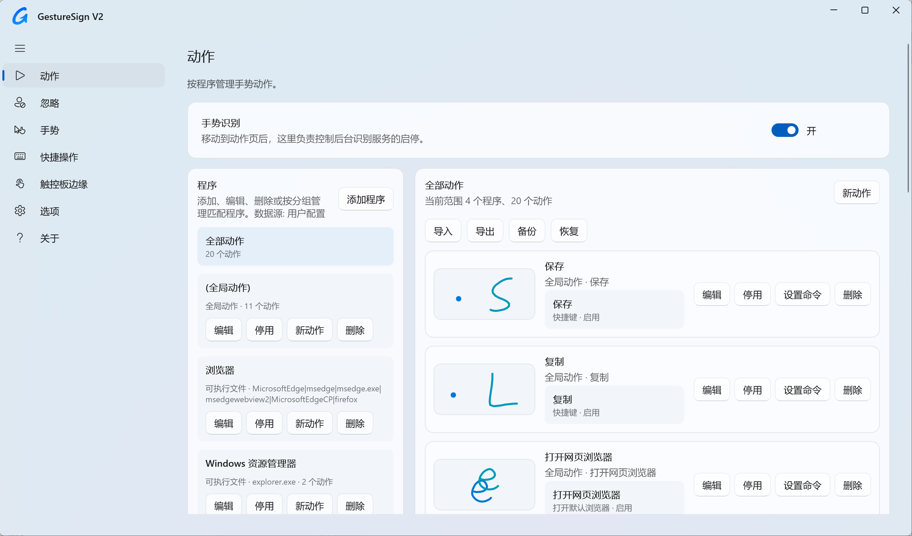
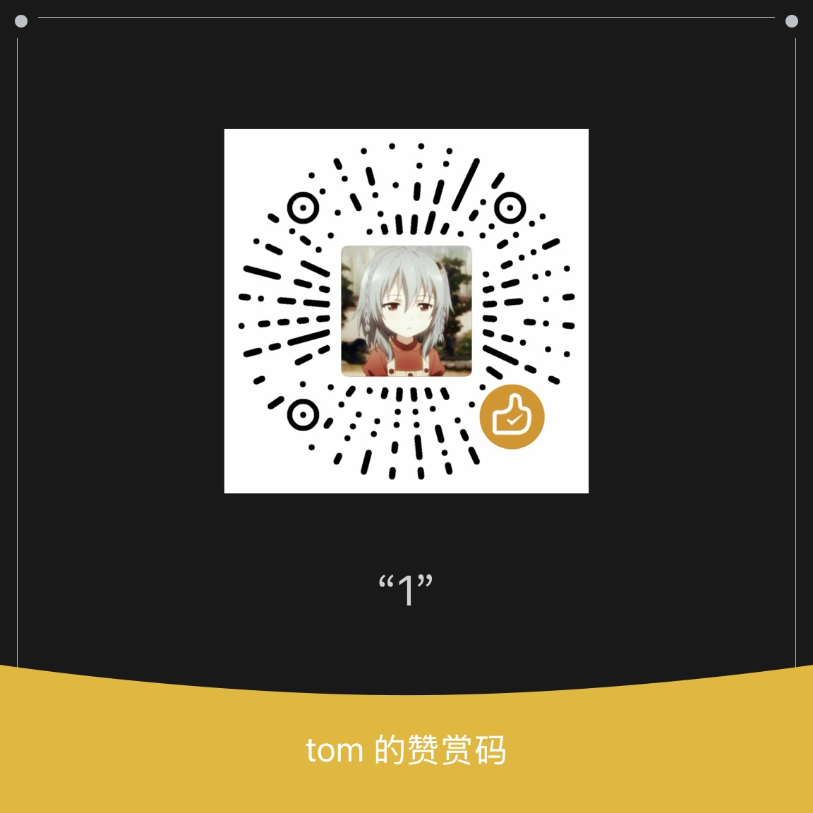

<p align="center">
  
</p>

<h1 align="center">GestureSign V2</h1>

<p align="center">
  面向 Windows 11 的触控板、触摸屏和鼠标手势工具，支持 TipTap、边缘交互与本地 AI 意图判断。
</p>

<p align="center">
  <a href="https://github.com/Tomclanc/GestureSignv2/releases/tag/v18.3.4">
    
  </a>
  <a href="https://winstall.app/apps/Tomclanc.GestureSignV2">
    
  </a>
  <a href="https://apps.microsoft.com/store/detail/9P2WKMHF43PN?cid=DevShareMCLPCB">
    
  </a>
  
  
  
</p>

<p align="center">
  简体中文 | <a href="#english">English</a> | <a href="#日本語">日本語</a> | <a href="#软件展示">软件展示 / Screenshots</a>
</p>

## 软件展示

### 动作管理

按应用管理手势与命令，查看轨迹缩略图，并导入、导出或备份配置。



### Kando 径向菜单演示

通过“快捷操作”按需下载 Kando，用独立快捷键唤起径向菜单。下图展示 Kando 菜单交互，主程序包不捆绑该组件。


动作管理截图为早期界面，Kando 动图为组件功能演示；具体布局和可用功能以安装版本为准。

## 项目简介

GestureSign V2 是基于经典开源项目 [TransposonY/GestureSign](https://github.com/TransposonY/GestureSign) 的 Windows 11 适配重构版。

原版 GestureSign 长期未维护，在新系统和高强度使用场景下容易遇到按键粘滞、界面老旧、DPI 适配不足等问题。这个版本的目标很直接：保留原来的手势能力，同时修复 Windows 11 下的体验问题，并用更现代的 WinUI 3 界面重新承载配置流程。

## 客制化软件开发

我也有偿承接客制化软件开发。有需求欢迎通过 [GitHub Issues](https://github.com/Tomclanc/GestureSignv2/issues) 联系，说明希望实现的功能、预算和期望交付时间。具体开发范围、费用与排期沟通后确认。

## 主要特性

- WinUI 3 重构界面，适配 Windows 11 圆角、Mica 风格、深色 / 亮色模式动态切换。
- 支持触控板手势、触摸屏手势、鼠标手势、手势轨迹显示和手势缩略图预览。
- 新增“快捷操作”页面，可按需下载 Kando 可选组件，并用独立快捷键唤起径向菜单。
- 新增“边缘交互”页面，可为触控板和触摸屏上 / 下 / 左 / 右边缘点击与边缘滑动单独绑定动作。
- 边缘手势可作为普通动作加入任意程序分组，当前应用动作优先，未命中时自动回退全局动作。
- 本地意图学习与实验性 AI 否决，支持手动纠正误判；可用推理后端及回退情况在设置中显示。
- 支持按程序、窗口类名、可执行文件、标题和分组管理动作。
- 支持快捷键、浏览器、窗口、媒体、系统操作等常用命令；新增动作时可直接配置要执行的命令，音量、亮度、打开文件、运行命令等常用命令提供专用编辑控件。
- 支持忽略列表，可按 exe、窗口类名、标题等规则排除指定程序。
- 支持优先使用系统触控板设置、Edge 自带手势，并可排除全屏场景。
- 支持将配置文件切换到 OneDrive `Apps\GestureSign V2` 目录，由 OneDrive 负责跨设备同步。
- 支持托盘图标、托盘菜单、单实例启动和更方便阅读的手势日志；托盘可一键暂停/恢复手势识别。
- 支持 90 种 Windows 语言和地区变体，并为阿拉伯语、波斯语、希伯来语、乌尔都语和维吾尔语提供从右到左布局。
- 针对高 DPI、高刷新率屏幕做了界面和输入体验优化。

## 下载

### Microsoft Store（推荐）

<a href="https://apps.microsoft.com/store/detail/9P2WKMHF43PN?cid=DevShareMCLPCB"></a>

### WinGet

GestureSign V2 已发布到 Windows Package Manager，可以直接通过 winget 安装：

```powershell
winget install --id Tomclanc.GestureSignV2 --source winget
```

也可以前往 [Releases](https://github.com/Tomclanc/GestureSignv2/releases/tag/v18.3.4) 下载最新便携版。

GitHub 当前版本为 **18.3.4**；Microsoft Store 和 WinGet 的上架进度可能不同，获取此版本请使用下方 GitHub 附件。

当前版本：

| 架构 | MSI 安装包 | 便携版 ZIP |
| --- | --- | --- |
| x64 | [MSI](https://github.com/Tomclanc/GestureSignv2/releases/download/v18.3.4/GestureSign-V2-18.3.4-x64.msi) | [ZIP](https://github.com/Tomclanc/GestureSignv2/releases/download/v18.3.4/GestureSign-V2-18.3.4-x64-portable.zip) |
| ARM64 | [MSI](https://github.com/Tomclanc/GestureSignv2/releases/download/v18.3.4/GestureSign-V2-18.3.4-arm64.msi) | [ZIP](https://github.com/Tomclanc/GestureSignv2/releases/download/v18.3.4/GestureSign-V2-18.3.4-arm64-portable.zip) |

MSI 约 21 MB，便携 ZIP 约 28 MB。主程序包剔除 .NET / WinUI 运行环境包；Kando 和 AI 组件均为可选 DLC，独立下载。便携版解压后运行 `GestureSign.WinUI.exe`，升级前退出旧版设置窗口和托盘后台。

运行需要对应架构的 .NET 10 Desktop Runtime 和 Windows App SDK Runtime。WinGet 会按清单安装依赖；手动安装或使用便携版时，请先安装所需运行环境。NPU 另需兼容硬件、驱动与 Windows ML 官方执行提供程序。

WinGet 18.3.4 的更新见 [提交记录](https://github.com/microsoft/winget-pkgs/pulls?q=is%3Apr+Tomclanc.GestureSignV2+18.3.4)。若源中尚未同步此版本，请使用上方 GitHub 下载。

## 更新内容

### 18.3.4

- 修复 Kando 更新时的进程路径识别、下载中断重试与权限错误；保留菜单及个人设置。
- 补齐 Kando 组件按钮、更新弹窗、进度和失败提示的 90 种语言适配。

### 18.3.3

- 修复多指独立绘制与保存，双指可以分别绘制不同方向，不受先按下左指还是右指影响；默认按位置识别时兼容旧模板。
- 保留双指点按适配：鼠标先移动到首个按下手指的位置，再发送右键。
- 修复手势库显示数量限制，新增和已有手势完整显示。
- 完善界面翻译并整合社区日语翻译资源。
- Kando 可选 DLC 下载自动选择 GitHub 最新正式版及匹配的 x64 / ARM64 架构，新增检查更新、更新说明、进度与一键更新；保留设置，失败时恢复旧版。
- 提供 x64 / ARM64 的精简 MSI 和便携包，运行环境与可选组件独立安装。

### 18.3.2

- AI 组件默认提供轻量 CPU 版，保留本地学习、训练、评分和 AI 否决；x64 下载约 0.78 MiB，解压约 3.15 MiB。
- 可选 NPU / GPU / CPU 硬件加速版，x64 下载约 24.49 MiB；NPU 厂商提供程序和缓存另计。两版复用对应架构的系统 .NET 10 Runtime。
- 保持已有 18.3.1 AI 组件的自动恢复兼容性，新增 AMD 旧缓存清理和组件后端校验。
- 切换 CPU / 硬件加速版前先卸载组件，样本和模型保留。AI 组件仍独立下载，不包含个人数据。

### 18.3.1

- 新增大控件、轨迹编号与触控板边缘宽度设置；AI 设置可整体折叠。
- 鼠标左、中、右键可分别启用为手势启动键，改进手势识别诊断。
- 可选 AI 组件复核所有触控板自由绘制动作，改进纠错、状态加载和合并通知；通知附带提示音。
- 新增界面文案覆盖 90 种语言与地区，修正 656 处译文；部分语种仍需母语复核。
- 移除自带亮度浮条；AI 组件继续独立下载。

### 18.3

- 触控板上、下、左、右四个边缘统一屏蔽已接管点击中的原生左键，避免右键动作同时触发左键；正确处理晚于触点结束的按键抬起。
- 保留普通点击、原本已按住的拖拽和软件注入的按键。低级鼠标事件无法可靠区分设备，边缘接管期间同时操作外接鼠标左键也可能被屏蔽。
- 修复 AI 否决在后台进程重启后丢失开启状态的问题；后台学习与 AI 否决独立保存。移除标题栏开发者预览标识。
- AI 组件仍可选下载，主程序不包含个人模型或训练数据。正式包默认不启用诊断日志。

### 历史版本

此前 18.2.9 加入可选本地 AI 学习、AI 否决、NPU 推理与样本纠正；更早版本加入了动作编辑中的 12 种 TipTap 选择与示意图、 Windows 11 原生亮度条、多指四方向 TipTap、单独发送 Win 键、边缘音量与亮度连续调节、四边滚动映射、触控板边缘光标固定和页面返回按钮；改进了无点击窗口激活、鼠标下方目标选择、智能关闭、桌面与全屏过滤及实时动作提示，并完善了 WinUI 3 界面、90 种语言与地区变体、RTL 布局、Kando 可选组件与升级迁移，以及输入、轨迹、触控和应用启动方面的修复。各版本详情请参阅 [GitHub Releases](https://github.com/Tomclanc/GestureSignv2/releases)。

## 安装

推荐使用 winget 安装：

```powershell
winget install --id Tomclanc.GestureSignV2 --source winget
```

也可以手动下载安装包：

1. 下载 MSI 或 MSIX 安装包。
2. 双击安装，按提示完成安装。
3. 从桌面快捷方式或开始菜单打开 `GestureSign V2`。
4. 在“动作”页面启用手势识别，并按需添加程序、手势和命令。

配置文件默认保存在：

```text
%AppData%\GestureSign V2
```

日志文件默认保存在：

```text
%LocalAppData%\GestureSign V2
```

## 快速使用

1. 打开“动作”页面，确认“手势识别”已开启。
2. 在左侧选择“全局动作”或某个程序分组。
3. 点击“新动作”，录制或绘制一个手势图案。
4. 点击“设置命令”，为这个手势绑定快捷键、浏览器、窗口或系统命令。
5. 回到桌面或目标应用中使用手势触发操作。

如果某个程序已经有系统级手势或自带手势，例如 Windows 11 触控板设置、Microsoft Edge 鼠标手势，可以在“选项”中开启优先使用系统或应用自带行为。

## 页面说明

- “动作”：管理全局动作、程序动作、分组、手势和命令。
- “忽略”：添加不参与识别的程序、窗口或匹配规则。
- “手势”：查看、导入、导出、重训和整理手势库。
- “快捷操作”：选择 Kando 菜单、同步唤起快捷键、打开 Kando 设置或测试弹出菜单。
- “边缘交互”：设置触控板和触摸屏四边点击与边缘滑动动作，以及触控板 TipTap 动作：按住 1、2 或 3 个手指，再用另一指在按住的手指组左、右、上、下轻点，可分别绑定共 12 种动作，支持连续轻点。
- “选项”：调整轨迹颜色、宽度、透明度、输入设备、全屏排除和启动项，并管理本地意图学习、AI 否决、样本纠正及推理组件。
- “关于”：查看版本、项目链接、日志和维护信息。

## Kando 可选 DLC 与更新

在“快捷操作”的 Kando 设置中按需下载组件，自动选择 GitHub 最新正式版及对应架构。主程序安装包和便携包均不捆绑 Kando。

由 GestureSign 下载管理的 Kando，可通过“检查更新”查看当前版本、可更新版本和更新说明，再执行更新。更新显示进度，保留菜单、设置和手势绑定，完成后恢复运行；失败时恢复旧版。自行指定的外部 Kando 提供更新指引，由用户按原安装方式更新。

## 兼容性

- 推荐系统：Windows 11 x64 / ARM64。
- GitHub 18.3.4 同时提供 x64 / ARM64 的 MSI 和便携 ZIP；请按设备架构选择，不提供 x86 包。
- Windows 10 理论上可运行部分功能，但主要适配目标是 Windows 11。

## 反馈问题

如果遇到手势无法触发、录制异常、配置无法保存或界面显示问题，请在 Issues 中提供：

- 系统版本和屏幕缩放比例。
- 使用的是鼠标、触控板还是触摸屏，并附设备型号。
- 目标应用名称，以及是否全屏。
- “关于”页面中的日志内容。
- 标注问题位置的截图，以及复现步骤和实际现象。

## 致谢

特别感谢 [Lambchop1020](https://github.com/Lambchop1020) 贡献日语翻译资源、推进界面翻译资源化，并指出代码中写死的中文文字。这些贡献已通过 [PR #13](https://github.com/Tomclanc/GestureSignv2/pull/13) 整合，保留原始提交与署名，并继续包含在 18.3.4 中。感谢你帮助 GestureSign V2 完善日语支持！详见 [日语本地化反馈 #10](https://github.com/Tomclanc/GestureSignv2/issues/10)。

感谢原项目 [TransposonY/GestureSign](https://github.com/TransposonY/GestureSign) 以及 HighSign、MahApps.Metro、WGestures 等项目。GestureSign V2 仍然站在这些工作的基础上继续前进。

“快捷操作”可以按需下载 [Kando](https://github.com/kando-menu/kando) 圆环菜单可选组件。Kando 默认不包含在 GestureSign 安装包中，可在应用内单独下载或卸载；Kando 是遵循 MIT License 的独立开源项目，组件保留其自带的 `LICENSE` 和 Chromium 相关许可证文件。

## 赞赏

如果 GestureSign V2 对你有帮助，欢迎通过微信赞赏支持项目的持续开发。感谢每一份支持。



---

## English

### Screenshots and demo

The [gallery above](#软件展示) shows per-app action management, gesture previews and command settings, followed by a demo of the optional Kando radial menu. Kando is downloaded separately. The action screenshot is from an earlier build; layout and available features depend on the installed version.

GestureSign V2 is a Windows 11 focused rebuild of the classic open-source project [TransposonY/GestureSign](https://github.com/TransposonY/GestureSign).

The original GestureSign has not been actively maintained for a long time. On newer Windows systems, users may run into sticky modifier keys, dated UI behavior, DPI issues, and inconsistent gesture capture. GestureSign V2 keeps the original gesture workflow while improving the Windows 11 experience and moving the configuration interface to a modern WinUI 3 design.

## Custom Software Development

I'm available for paid custom software development. To discuss a project, contact me through [GitHub Issues](https://github.com/Tomclanc/GestureSignv2/issues) with the features you need, your budget, and your preferred delivery date. Scope, pricing, and schedule will be agreed upon after discussing the requirements.

## Features

- Rebuilt WinUI 3 interface with Windows 11 rounded corners, Mica styling, and light / dark theme support.
- Touchpad, touchscreen, and mouse gestures with gesture trails and thumbnail previews.
- New Quick Actions page with an optional on-demand Kando component and dedicated hotkey triggers.
- New Edge Interaction page for touchpad and touchscreen edge taps and edge swipes.
- Edge gestures can also be added to regular app groups; app-specific actions take priority and fall back to global actions when no executable app action is found.
- Local intent learning and experimental AI veto with manual corrections and visible inference backend/fallback status.
- Per-app actions with matching by executable, window class, title, and groups.
- Common commands such as hotkeys, browser actions, window actions, media controls, system operations, file launching, volume, brightness, and command execution. New actions can include their initial command directly from the add-action dialog.
- Ignore list support for excluding specific apps, windows, or matching rules.
- Options to prefer Windows touchpad gestures or built-in browser gestures, with fullscreen exclusions.
- Optional OneDrive sync stores configuration under `OneDrive\Apps\GestureSign V2` and lets OneDrive handle cross-device synchronization.
- Tray icon, tray menu, single-instance startup, readable gesture logs, and one-click pause/resume from the tray.
- 90 Windows language and regional variants, with right-to-left layout for Arabic, Persian, Hebrew, Urdu, and Uyghur.
- Improved UI and input behavior for high-DPI and high-refresh-rate displays.

## Download

### Microsoft Store (recommended)

<a href="https://apps.microsoft.com/store/detail/9P2WKMHF43PN?cid=DevShareMCLPCB"></a>

### WinGet

GestureSign V2 is available from Windows Package Manager. Install it with winget:

```powershell
winget install --id Tomclanc.GestureSignV2 --source winget
```

You can also get the latest portable build from [Releases](https://github.com/Tomclanc/GestureSignv2/releases/tag/v18.3.4).

The current GitHub release is **18.3.4**. Microsoft Store and WinGet availability may differ; use the GitHub assets below for this version.

Current version:

| Architecture | MSI installer | Portable ZIP |
| --- | --- | --- |
| x64 | [MSI](https://github.com/Tomclanc/GestureSignv2/releases/download/v18.3.4/GestureSign-V2-18.3.4-x64.msi) | [ZIP](https://github.com/Tomclanc/GestureSignv2/releases/download/v18.3.4/GestureSign-V2-18.3.4-x64-portable.zip) |
| ARM64 | [MSI](https://github.com/Tomclanc/GestureSignv2/releases/download/v18.3.4/GestureSign-V2-18.3.4-arm64.msi) | [ZIP](https://github.com/Tomclanc/GestureSignv2/releases/download/v18.3.4/GestureSign-V2-18.3.4-arm64-portable.zip) |

MSI downloads are about 21 MB and portable ZIPs about 28 MB. The packages use shared .NET / WinUI runtimes. Kando and AI components are separate optional downloads. Extract the portable ZIP and run `GestureSign.WinUI.exe`; exit the old settings window and tray daemon before upgrading.

The matching .NET 10 Desktop Runtime and Windows App SDK Runtime are required. WinGet installs the declared dependencies; install them separately when using the MSI manually or the portable ZIP. NPU use also requires compatible hardware, drivers and an official Windows ML execution provider.

See [WinGet submissions](https://github.com/microsoft/winget-pkgs/pulls?q=is%3Apr+Tomclanc.GestureSignV2+18.3.4). Use the GitHub downloads above if your source has not yet received 18.3.4.

### What's new in 18.3.4

- Fix Kando process path detection, interrupted download retries and update permission errors while retaining menus and settings.
- Complete Kando component controls, update dialogs, progress and error text in all 90 supported languages.

### What's new in 18.3.3

- Capture and save independent multitouch strokes, including opposite directions; recognition no longer depends on which finger touches down first. Existing templates remain compatible with the default spatial ordering.
- Preserve two-finger right-click positioning at the first finger's initial contact.
- Display every saved gesture instead of limiting the library cards.
- Improve UI localization and integrate community Japanese translations.
- Download the latest stable Kando for x64 / ARM64; add update checks, release notes, progress and managed updates with settings preservation and rollback.
- Provide slim x64 / ARM64 MSI and portable packages with separate runtimes and optional components.

### What's new in 18.3.2

- Default to a lightweight CPU AI component with local training, scoring and AI veto: about 0.78 MiB to download and 3.15 MiB unpacked on x64.
- Offer an optional NPU / GPU / CPU component: about 24.49 MiB to download on x64, excluding additional vendor providers and caches. Both variants use the matching shared .NET 10 Runtime.
- Preserve automatic resume for installed 18.3.1 AI components; add bounded AMD cache cleanup and package backend validation.
- Uninstall the component before switching variants. Personal samples and models are preserved, and AI remains a separate optional download.

### What's new in 18.3.1

- Accessibility controls, trace numbering and adjustable touchpad edge width.
- Independent left/middle/right mouse gesture start buttons.
- Optional AI review for all touchpad drawing actions, improved correction, loading and grouped notifications.
- 90-locale coverage for recent UI text with 656 corrections; native review remains pending for some locales.
- Removed the custom brightness overlay; AI components remain separate downloads.

### What's new in 18.3

- Apply native left-click suppression consistently to configured taps on all four touchpad edges, including button-up events arriving after contact release.
- Preserve normal clicks, pre-existing drags and injected actions. A simultaneous external-mouse left click may also be suppressed while an edge capture owns input.
- Persist AI veto across background-host restarts independently of background learning; remove the developer-preview title suffix.
- Keep AI components optional and personal training data out of packages. Diagnostic logging is disabled by default.

### Previous releases

18.2.9 introduced optional local AI learning, veto, NPU inference and sample correction. Earlier releases added a 12-combination TipTap selector and visual previews in action editors, the native Windows 11 brightness flyout, multi-finger TipTap in four directions, standalone Win key selection, continuous edge volume and brightness adjustment, scrolling mappings on all four edges, touchpad edge pointer locking, and back navigation. They also improved activation without clicking, selection of the window under the pointer, Smart Close, desktop and fullscreen filtering, and live action hints, alongside the WinUI 3 interface, 90 language and regional variants, RTL layout, optional Kando integration and upgrade migration, and fixes for input, gesture trails, touch interactions, and application launching. See [GitHub Releases](https://github.com/Tomclanc/GestureSignv2/releases) for version-by-version details.

## Installation

Recommended:

```powershell
winget install --id Tomclanc.GestureSignV2 --source winget
```

Manual installation:

1. Download the MSI or MSIX installer.
2. Double-click the installer and follow the setup prompts.
3. Open `GestureSign V2` from the desktop shortcut or Start menu.
4. Go to the Actions page, enable gesture recognition, and add apps, gestures, and commands as needed.

Configuration files are stored in:

```text
%AppData%\GestureSign V2
```

When OneDrive sync is enabled, configuration is stored in:

```text
%UserProfile%\OneDrive\Apps\GestureSign V2
```

Log files are stored in:

```text
%LocalAppData%\GestureSign V2
```

## Quick Start

1. Open the Actions page and make sure gesture recognition is enabled.
2. Select Global Actions or an app group on the left.
3. Click New Action and record or draw a gesture pattern.
4. Click Set Command and bind the gesture to a hotkey, browser action, window action, or system command.
5. Return to the desktop or target app and trigger the gesture.

If an app already has system-level or built-in gestures, such as Windows 11 touchpad gestures or Microsoft Edge mouse gestures, you can enable the related preference options on the Options page.

## Pages

- Actions: Manage global actions, app actions, groups, gestures, and commands.
- Ignore: Exclude apps, windows, or matching rules from gesture recognition.
- Gestures: View, import, export, retrain, and organize the gesture library.
- Quick Actions: Select Kando menus, sync hotkeys, open Kando settings, or test the radial menu.
- Edge Interaction: Configure taps and swipes along all four edges of the touchpad and touchscreen, plus touchpad TipTap actions: hold one, two, or three fingers and tap with another finger to the left, right, above, or below the held finger group. Each of the 12 combinations can have its own action, and repeated taps are supported.
- Options: Adjust trail color, width, opacity, input devices, fullscreen exclusions, and startup behavior; manage local intent learning, AI veto, sample corrections, and inference components.
- About: View the version, project links, logs, and maintenance information.

## Optional Kando component and updates

Download Kando from its settings in Quick Actions. GestureSign selects the latest stable GitHub release for your architecture. Kando is a separate optional component.

For installations managed by GestureSign, check for updates to view installed and available versions and release notes, then update with progress reporting. Menus, settings and gesture bindings are preserved; Kando restarts afterward, and failed updates restore the previous version. External installations receive update guidance using their original installation method.

## Compatibility

- Recommended OS: Windows 11 x64 / ARM64.
- GitHub 18.3.4 provides x64 / ARM64 MSI and portable ZIP packages. Choose the architecture matching your device; x86 is not supported.
- Windows 10 may run some features, but Windows 11 is the primary target.

## Feedback

When reporting gesture, recording, saving, or UI issues, please include:

- Windows version and display scaling.
- Input device: mouse, touchpad or touchscreen, including the device model.
- Target app name and whether it is fullscreen.
- Logs from the About page.
- Screenshots marking the problem, reproduction steps and actual behavior.

## Credits

Special thanks to [Lambchop1020](https://github.com/Lambchop1020) for contributing Japanese translation resources, moving UI translations into the localization catalog, and identifying hard-coded Chinese text. These contributions were integrated in [PR #13](https://github.com/Tomclanc/GestureSignv2/pull/13), with the original commit and attribution preserved, and remain included in 18.3.4. Thank you for helping improve Japanese support in GestureSign V2! See [Japanese localization feedback #10](https://github.com/Tomclanc/GestureSignv2/issues/10).

Thanks to [TransposonY/GestureSign](https://github.com/TransposonY/GestureSign), HighSign, MahApps.Metro, WGestures, and the projects this work builds on.

Quick Actions can download the [Kando](https://github.com/kando-menu/kando) radial-menu component on demand. Kando is not bundled with GestureSign by default and can be installed or removed separately in the app. Kando remains an independent MIT-licensed project, and the downloaded component retains its `LICENSE` and Chromium license files.

## Support the project

If GestureSign V2 is useful to you, you can support its continued development via WeChat Pay. Every contribution is appreciated.


---

## 日本語

### 画面とデモ

[上のギャラリー](#软件展示)では、アプリ別のアクション管理、ジェスチャープレビュー、コマンド設定と、オプションの Kando 円形メニューのデモを紹介しています。Kando は別途ダウンロードするコンポーネントです。アクション画面は以前のバージョンのため、実際の配置や利用できる機能はインストールしたバージョンによって異なります。

GestureSign V2 は、クラシックなオープンソースプロジェクト [TransposonY/GestureSign](https://github.com/TransposonY/GestureSign) を Windows 11 向けに再構築したバージョンです。

元の GestureSign は長い間積極的にメンテナンスされていません。新しい Windows 環境では、修飾キーが押されたままになる、UI の挙動が古い、高 DPI 環境で表示が崩れる、ジェスチャー入力が安定しない、といった問題が起こることがあります。GestureSign V2 は従来のジェスチャーワークフローを保ちながら、Windows 11 での体験を改善し、設定画面をモダンな WinUI 3 デザインへ移行しています。

## ソフトウェアの受託開発

有償でソフトウェアのカスタム開発を承っています。ご相談は [GitHub Issues](https://github.com/Tomclanc/GestureSignv2/issues) から、実現したい機能、ご予算、ご希望の納期をお知らせください。開発範囲、費用、スケジュールはご相談のうえ決定します。

## 主な機能

- Windows 11 の角丸、Mica スタイル、ライト / ダークテーマに対応した WinUI 3 インターフェイス。
- タッチパッド、タッチスクリーン、マウスジェスチャー、ジェスチャー軌跡、ジェスチャーサムネイルプレビュー。
- Kando のオプションコンポーネントを必要なときにダウンロードできる Quick Actions ページと、専用ホットキーによる呼び出し。
- タッチパッドとタッチスクリーンのエッジタップ / エッジスワイプを設定できる Edge Interaction ページ。
- エッジジェスチャーは通常のアプリグループにも追加でき、アプリ別アクションを優先し、見つからない場合はグローバルアクションへフォールバックします。
- ローカル意図学習と実験的な AI 拒否、誤判定の手動修正、推論バックエンドとフォールバック状態の表示。
- 実行ファイル、ウィンドウクラス、タイトル、グループによるアプリ別アクション管理。
- ホットキー、ブラウザー操作、ウィンドウ操作、メディア制御、システム操作などの一般的なコマンド。新規アクション作成時に初期コマンドも同じダイアログで設定できます。
- 特定のアプリ、ウィンドウ、マッチングルールを除外できる無視リスト。
- Windows タッチパッドジェスチャーやブラウザー内蔵ジェスチャーを優先するオプションと、全画面除外設定。
- OneDrive 同期を有効にすると、設定を `OneDrive\Apps\GestureSign V2` に保存し、OneDrive でデバイス間同期できます。
- トレイアイコン、トレイメニュー、単一インスタンス起動、読みやすいジェスチャーログ、トレイからの一時停止 / 再開。
- 90 種類の Windows 言語／地域バリアント。アラビア語、ペルシア語、ヘブライ語、ウルドゥー語、ウイグル語では右から左のレイアウトに対応します。
- 高 DPI および高リフレッシュレート環境向けの UI と入力体験の改善。

## ダウンロード

### Microsoft Store（推奨）

<a href="https://apps.microsoft.com/store/detail/9P2WKMHF43PN?cid=DevShareMCLPCB"></a>

### WinGet

GestureSign V2 は Windows Package Manager からインストールできます:

```powershell
winget install --id Tomclanc.GestureSignV2 --source winget
```

最新のポータブル版は [Releases](https://github.com/Tomclanc/GestureSignv2/releases/tag/v18.3.4) からも入手できます。

GitHub の現在のリリースは **18.3.4** です。Microsoft Store と WinGet では公開時期が異なる場合があるため、このバージョンは以下の GitHub 添付ファイルから入手してください。

現在のバージョン:

| アーキテクチャ | MSI インストーラー | ポータブル ZIP |
| --- | --- | --- |
| x64 | [MSI](https://github.com/Tomclanc/GestureSignv2/releases/download/v18.3.4/GestureSign-V2-18.3.4-x64.msi) | [ZIP](https://github.com/Tomclanc/GestureSignv2/releases/download/v18.3.4/GestureSign-V2-18.3.4-x64-portable.zip) |
| ARM64 | [MSI](https://github.com/Tomclanc/GestureSignv2/releases/download/v18.3.4/GestureSign-V2-18.3.4-arm64.msi) | [ZIP](https://github.com/Tomclanc/GestureSignv2/releases/download/v18.3.4/GestureSign-V2-18.3.4-arm64-portable.zip) |

MSI は約 21 MB、ポータブル ZIP は約 28 MB です。.NET / WinUI の実行環境は同梱せず、システムの共有ランタイムを使用します。Kando と AI は任意の追加ダウンロードです。ZIP を展開し、`GestureSign.WinUI.exe` を実行してください。更新前に旧版の設定画面とトレイのバックグラウンドプロセスを終了します。

対応アーキテクチャの .NET 10 Desktop Runtime と Windows App SDK Runtime が必要です。WinGet は宣言された依存関係をインストールします。MSI を手動でインストールする場合やポータブル版を使用する場合は、必要なランタイムを別途インストールしてください。NPU の利用には対応ハードウェア、ドライバー、Windows ML 公式実行プロバイダーも必要です。

WinGet の更新は [提出記録](https://github.com/microsoft/winget-pkgs/pulls?q=is%3Apr+Tomclanc.GestureSignV2+18.3.4) をご覧ください。18.3.4 がまだ配信されていない場合は、上記の GitHub ダウンロードをご利用ください。

### 18.3.4 の更新内容

- Kando 更新時のプロセス検出、ダウンロード再試行とアクセス権の問題を修正。メニューと設定は保持します。
- Kando のボタン、更新ダイアログ、進捗表示とエラー表示を全 90 言語に対応。

### 18.3.3 の更新内容

- 複数指の軌跡を個別に描画・保存でき、2 本の指で異なる方向を描けます。先に触れた指の順序に依存せず認識し、既定の位置順設定では既存のテンプレートも利用できます。
- 2 本指の右クリックでは、最初に触れた指の位置へカーソルを移動してから右クリックします。
- ジェスチャー一覧の表示数制限を修正し、保存済みの全ジェスチャーを表示します。
- UI 翻訳を改善し、コミュニティの日本語翻訳を統合しました。
- Kando の最新安定版を x64 / ARM64 に合わせてダウンロード。更新確認、リリースノート、進捗表示、設定の保持と失敗時の復元に対応しました。
- x64 / ARM64 の軽量 MSI とポータブル版を提供。ランタイムと任意コンポーネントは別途インストールします。

### 18.3.2 の更新内容

- 軽量 CPU 版 AI を既定にし、ローカル学習、スコアリング、AI 拒否を維持。x64 のダウンロードは約 0.78 MiB、展開後は約 3.15 MiB です。
- NPU / GPU / CPU 版も選択可能で、x64 のダウンロードは約 24.49 MiB。ベンダーの追加プロバイダーとキャッシュは別途必要です。両版とも対応アーキテクチャの共有 .NET 10 Runtime を使用します。
- 既存の 18.3.1 AI の自動再開互換性を維持し、AMD の古いキャッシュの整理とパッケージ検証を追加しました。
- 版の切り替え前に AI コンポーネントをアンインストールしてください。サンプルとモデルは保持されます。

### 18.3 の更新内容

- タッチパッドの上下左右の端に設定したタップで、意図しない左クリックを抑制。指を離した後に届くボタン解放にも対応しました。
- 通常のクリック、開始済みのドラッグ、ソフトウェアによる入力は維持します。端の操作と同時に外付けマウスを左クリックした場合も抑制されることがあります。
- AI 拒否の有効状態をバックグラウンド学習とは独立して保存し、プロセス再起動後に復元。タイトルの開発者プレビュー表示を削除しました。
- AI は引き続き任意ダウンロードです。個人の学習データは同梱せず、診断ログは既定で無効です。

### 過去のバージョン

これまでのバージョンでは、アクション編集画面の 12 通りの TipTap 選択とプレビュー、Windows 11 標準の明るさ表示、複数指・四方向の TipTap、Win キー単独送信、エッジ操作による音量・明るさの連続調整、四辺へのスクロール割り当て、タッチパッドのエッジ操作中のカーソル固定、戻るボタンを追加しました。また、クリックを伴わないウィンドウのアクティブ化、カーソル下の対象選択、Smart Close、デスクトップと全画面の判定、リアルタイムのアクションヒントを改善し、WinUI 3 UI、90 種類の言語・地域対応、RTL レイアウト、Kando のオプション連携とアップグレード移行を整備するとともに、入力、ジェスチャー軌跡、タッチ操作、アプリ起動の問題を修正しました。各バージョンの詳細は [GitHub Releases](https://github.com/Tomclanc/GestureSignv2/releases) をご覧ください。

## インストール

推奨:

```powershell
winget install --id Tomclanc.GestureSignV2 --source winget
```

手動インストール:

1. MSI または MSIX インストーラーをダウンロードします。
2. インストーラーをダブルクリックし、画面の案内に従ってセットアップを完了します。
3. デスクトップショートカットまたはスタートメニューから `GestureSign V2` を開きます。
4. Actions ページでジェスチャー認識を有効にし、必要に応じてアプリ、ジェスチャー、コマンドを追加します。

設定ファイルは次の場所に保存されます:

```text
%AppData%\GestureSign V2
```

OneDrive 同期を有効にした場合、設定ファイルは次の場所に保存されます:

```text
%UserProfile%\OneDrive\Apps\GestureSign V2
```

ログファイルは次の場所に保存されます:

```text
%LocalAppData%\GestureSign V2
```

## クイックスタート

1. Actions ページを開き、ジェスチャー認識が有効になっていることを確認します。
2. 左側で Global Actions またはアプリグループを選択します。
3. New Action をクリックし、ジェスチャーパターンを記録または描画します。
4. Set Command をクリックし、そのジェスチャーにホットキー、ブラウザー操作、ウィンドウ操作、またはシステムコマンドを割り当てます。
5. デスクトップまたは対象アプリに戻り、ジェスチャーを実行します。

アプリが Windows 11 のタッチパッドジェスチャーや Microsoft Edge のマウスジェスチャーなど、システムまたはアプリ内蔵のジェスチャーを持っている場合は、Options ページで関連する優先オプションを有効にできます。

## ページ

- Actions: グローバルアクション、アプリアクション、グループ、ジェスチャー、コマンドを管理します。
- Ignore: ジェスチャー認識から除外するアプリ、ウィンドウ、マッチングルールを設定します。
- Gestures: ジェスチャーライブラリの表示、インポート、エクスポート、再学習、整理を行います。
- Quick Actions: Kando メニューの選択、ホットキー同期、Kando 設定の起動、ラジアルメニューのテストを行います。
- Edge Interaction: タッチパッドとタッチスクリーンの四辺でのタップ／スワイプに加え、タッチパッドの TipTap アクションを設定します。1 本、2 本、または 3 本の指を置いたまま、別の指でその指のグループの左・右・上・下を軽くタップすると、合計 12 通りの操作にそれぞれアクションを割り当てられます。連続タップにも対応しています。
- Options: 軌跡の色、幅、透明度、入力デバイス、全画面除外、起動動作を調整し、ローカル意図学習、AI 拒否、サンプル修正、推論コンポーネントを管理します。
- About: バージョン、プロジェクトリンク、ログ、メンテナンス情報を確認します。

## Kando の任意ダウンロードと更新

Quick Actions の Kando 設定から必要に応じてダウンロードできます。GitHub の最新安定版と対応アーキテクチャを自動選択し、主プログラムには同梱しません。

GestureSign が管理する Kando は、更新確認で現在のバージョン、更新可能なバージョン、リリースノートを確認して更新できます。進捗を表示し、メニュー、設定、ジェスチャーの割り当てを保持して再起動します。更新に失敗した場合は旧版を復元します。外部の Kando は元のインストール方法で更新するための案内を表示します。

## 互換性

- 推奨 OS: Windows 11 x64 / ARM64。
- GitHub 18.3.4 は x64 / ARM64 の MSI とポータブル ZIP を提供します。デバイスに合うアーキテクチャを選択してください。x86 は提供しません。
- Windows 10 でも一部機能は動作する可能性がありますが、主な対象は Windows 11 です。

## ポータブルパッケージの検証

リリース前に、ポータブル展開先の必須ファイルと不要な診断ファイルを検証できます。PowerShell で次を実行してください。

```powershell
.\tools\Test-PortablePackage.ps1 -PackagePath .\publish\portable -MinimumFileCount 200 -SharedRuntimeOnly
```

この検証では必須ファイルと共有ランタイムへの依存を確認し、同梱された .NET / WinUI ランタイム、Kando / AI コンポーネント、PDB / ダンプ / 診断ログを拒否します。
MSI を生成せず、検証済みのポータブル Payload だけを作成する場合は、次を使用できます。

```powershell
.\installer\Build-GestureSignV2-KandoMsi.ps1 -PayloadOnly -PublishDir .\publish\portable
```

## ビルド警告の回帰防止

CI はビルドログ中の警告をファイル・行・警告コード単位で正規化し、`tools/warning-baseline.json` と比較します。既存の警告は直ちにビルドを止めませんが、新しい警告地点が追加されると CI が失敗します。ローカルでは次のように実行できます。

```powershell
dotnet build GestureSign.Daemon/GestureSign.Daemon.csproj -c Release *> daemon-build.log
dotnet build GestureSign.WinUI/GestureSign.WinUI.csproj -c Release *> winui-build.log
.\tools\Test-WarningBaseline.ps1 -LogPath daemon-build.log,winui-build.log
```

現在のローカル基線は 0 個の警告位置です。新しい警告地点が追加された場合は CI が失敗します。`-UpdateBaseline` は警告を意図的に修正した後にのみ使用してください。

## フィードバック

ジェスチャー、記録、保存、UI 表示に関する問題を報告する場合は、次の情報を含めてください。

- Windows のバージョンとディスプレイの拡大率。
- マウス、タッチパッド、タッチスクリーンのどれを使用しているかと、デバイスの型番。
- 対象アプリ名と、全画面表示かどうか。
- About ページのログ。
- 問題の箇所を示したスクリーンショット、再現手順、実際の挙動。

## クレジット

[Lambchop1020](https://github.com/Lambchop1020) さんには、日本語翻訳リソースの提供、UI 翻訳のリソース化、コードに直接記述された中国語テキストの指摘にご協力いただきました。心より感謝します。これらの貢献は [PR #13](https://github.com/Tomclanc/GestureSignv2/pull/13) で元のコミットと作者名を保持して統合され、18.3.4 にも引き継がれています。GestureSign V2 の日本語対応の改善にご協力いただき、ありがとうございます！詳しくは [日本語ローカライズの提案 #10](https://github.com/Tomclanc/GestureSignv2/issues/10) をご覧ください。

[TransposonY/GestureSign](https://github.com/TransposonY/GestureSign)、HighSign、MahApps.Metro、WGestures、および本プロジェクトの基礎となった各プロジェクトに感謝します。

Quick Actions では、[Kando](https://github.com/kando-menu/kando) のラジアルメニューをオプションコンポーネントとして必要なときにダウンロードできます。Kando は GestureSign に既定では同梱されず、アプリ内で個別にインストールまたは削除できます。Kando は MIT License の独立したオープンソースプロジェクトで、ダウンロードしたコンポーネントには `LICENSE` と Chromium 関連のライセンスファイルが保持されます。

## プロジェクトを支援

GestureSign V2 が役に立った場合は、WeChat Pay の赞赏码から継続開発を支援できます。ご支援ありがとうございます。


